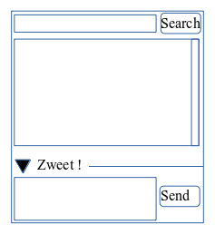

# TP 2 : Squelette de l'application

## Objectifs

- Editer une vue en FXML
- Se familiariser avec les composants JavaFX
- Lier FXML et contrôleur

## La fenêtre principale

Layout désiré :

      
Les étapes:
      
1. Editer un fichier fxml nommé MainScreen.fxml 
   Soit avec SceneBuilder, soit via un éditeur XML (celui de l'IDE par exemple). 
   Ce FXML est basé sur le composant racine BorderPane.
      
2. Mettre 3 zones dans le BorderPane 
   Nous souhaitons obtenir une fenêtre découpée en 3 parties : 
   
   - une zone de recherche en haut
   - une zone d'affichage des Zweets au centre (le gros de l'écran) 
   - une zone d'écriture de nouveaux Zweets en bas. 
   
   Nous définirons donc 3 conteneurs différents aux parties « bottom » « center » et « top » du BorderPane.
      
3. Zone de recherche 
  La partie haute de l'application regroupe un champ de saisie ainsi qu'un bouton de recherche alignés horizontalement. 
  On utilisera donc un conteneur HBox pour arranger les éléments de cette partie :
  le champ de saisie doit pouvoir occuper tout l'espace disponible horizontalement; le bouton utilisera sa taille par défaut.
      
4. Liste centrale  
  La zone centrale est l'emplacement d'un composant ListView (tableau simple en JavaFX). 
  Pour permettre plus de liberté en cas d'évolution, ce composant ListView sera contenu dans un composant AnchorPane. 
  Afin de pouvoir utiliser par la suite le composant ListView, on lui affecte un fx:id à la valeur « timeline ».
      
5. Zone de saisie  
   Pour la partie inférieure avec saisie de zweet, on utilisera une HBox. 
   Dedans, on placera un champs de saisie multi-ligne qui prendra  le plus de place posssible ainsi qu'un bouton d'envoi. 
   Afin de rendre la zone masquable, on décide d'utiliser un TitledPane dans la partie inférieure de l'écran. 
   Modifier le FXML afin de l'afficher correctement.

## Utiliser ZwitterAPI, lier le FXML et le contrôleur

1. Injecter le composant ListView dans le contrôleur Java soit par son identifiant public, soit via une annotation @FXML.

2. Implémenter l'interface Initializable de JavaFX dans le contrôleur Java 
   La méthode initialize(...) sera appelée après l'initialisation de tous les composants JavaFX définis en FXML (ils ne seront pas nuls).
      
3. Définir une collection bindable pour JavaFX dans le contrôleur
      
        ObservableList<Zweet> list =
      	  FXCollections.observableList(new LinkedList<Zweet>());
      
4. Pour utiliser « Zwitter » on utilise une API fluent avec la classe ZwitterBuilder. 
   On peut préciser la liste qui sera remplie des Zweets via la méthode withObservableList(...), on peut aussi préciser un nombre maximum d'éléments dans la liste.

        Zwitter zwitter = ZwitterBuilder.create().withObservableList(list).build();

      
5. Affecter la collection au composant JavaFX via la méthode setItems
      
6. Démarrer Zwitter au démarrage, puis tester
      
        zwitter.start();
      
7. Stopper zwitter lorsque l'application se termine (*Application.stop*) :
      
        zwitter.stop() ;
