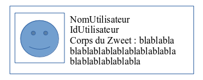

# TP 4 : Composant en Java

## Objectifs

- Définir un composant en Java
- Définir un composant en FXML avec racine personnalisée via fx:root
- Utiliser un composant personnalisé dans une CellFactory
- Utiliser le layout GridPane

## CellFactory et composant personnalisé en Java

1. Créer un nouveau composant Java nommé ZweetPane dans le package com.zenika.fx.zwitter.zweetui.

2. Définir le rendu de ce composant selon l'image ci-dessous à l'aide d'un GridPane en Java :

    

3. Dans ce composant Java, définir une méthode setZweet(Zweet zweet) qui affiche le contenu du Zweet dans le composant.

4. Utiliser ce composant à la place du composant Text défini dans la CellFactory du TP2.

5. Tester le rendu.

## Utilisation de fx:root

1. On désire cette fois-ci implémenter ce composant à l'aide de FXML, ajouter un nouveau fichier FXML nommé zweetPane.fxml au projet et y définir le rendu.

2. Afin de pouvoir utiliser ce fichier FXML dans un CellFactory, nous allons utiliser un design pattern de type « MVVM » : 
    
   Modifier la classe Java ZweetPane  et charger le FXML défini précedemment à l'aide de FXMLLoader dans le constructeur de ZweetPane :

        FXMLLoader fxmlLoader = new 
          FXMLLoader(getClass().getResource("zweetPane.fxml"));
        fxmlLoader.setRoot(this);
        fxmlLoader.setController(this);
        try {
          fxmlLoader.load();
        } catch (IOException e) {
          e.printStackTrace();
        }

3. Dans le fichier FXML, utiliser la balise &lt;fx:root&gt; comme racine et spécifier l'attribut « type » à la valeur javafx.scene.layout.GridPane.

4. Injecter les composants FXML dans ZweetPane avec l'annotation @FXML. Retirer le code de construction de vue de ZweetPane réalisée dans la partie 2 de ce TP.

5. Modifier le constructeur de ZweetPane afin qu'il prenne un Zweet comme paramètre qui sera stocké en tant que variable d'instance.

6. Implémenter l'interface Initializable et appeler setZweet(zweet) dedans où zweet est la valeur du Zweet utilisé pour la construction de ZweetPane.

7. Tester le rendu.
