# Éléments graphiques

<!-- .slide: class="page-title" -->


## Sommaire

@@@ TODO


## Introduction

L'architecture choisie par JavaFX
 
 - *Tous les composants et conteneurs affichés dans la scène sont des Nodes* 
 - *Tous les composants sont dessinés par JavaFX* 
   - Pas de composants système comme en AWT ou SWT / Eclipse RCP 
   - Il n'est pour l'instant pas possible d'accéder aux API de dessin très bas niveau (instructions OpenGL notamment) 
   - Tout est vectorisé, y compris les textes! 
 - *Ils sont décorés à l'aide de feuille de style CSS / skins*


## Les composants JavaFX

*Aperçu rapide*

<figure>
   
</figure>


## Les composants JavaFX

<br>

<br>

- *Boutons et liens simples*
  - Button
  - CheckBox
  - Hyperlink
  - RadioButton
  - ToggleButton

<figure style="position: absolute; top: 25%; right: 2%; width: 55%">
    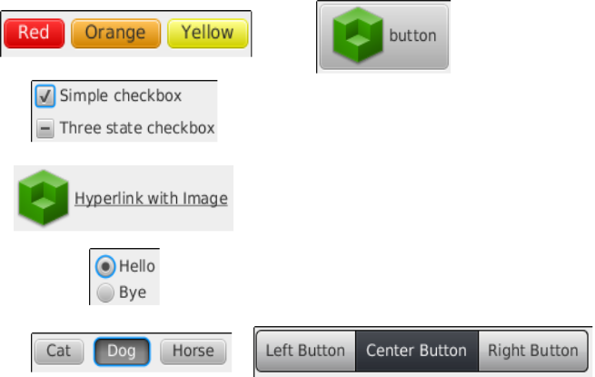
</figure>


##Les composants de JavaFX

- *Les divers contrôles pour manipuler du texte:*
  - TextFlow (*conteneur*)
  <br>
  - Label 
  - TextField
  - TextArea
  - HTMLEditor
  - Text (*forme*)
        
- *Les fonctionnalités* 
  - Edition de texte plat ou pseudo-HTML 
  - Personnalisation par CSS 
  - Contrôle fin sur le rendu 


<figure style="position: absolute; bottom: 2%; right: 2%; width: 42%">
    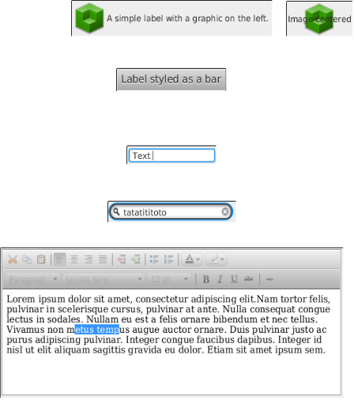
</figure>


## Les composants de JavaFX

<br>

- *Barres, menus et groupes*
  - MenuBar, Menu, MenuItem 
  - Pagination 
  - ToolBar (avec style CSS) 
  - TabPane, Tab 
  - Accordion 
  - SplitPane 
    - Division cachée via css, 2 régions 
  
<figure style="position: absolute; top: 20%; right: 2%">
    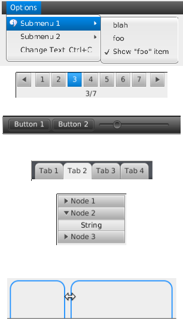
</figure>


## Les composants de JavaFX

- *Les tableaux et dérivés*
  - ListView 
    - Le plus classique 
    - Possibilité de personnaliser les colonnes 
  - TreeView 
    - Affichage hiérarchique de données 
  - TableView 
    - Le plus complet 
    - Colonnes et lignes 
    - Entièrement personnalisable
     
<figure style="position: absolute; top: 20%; right: 2%">
    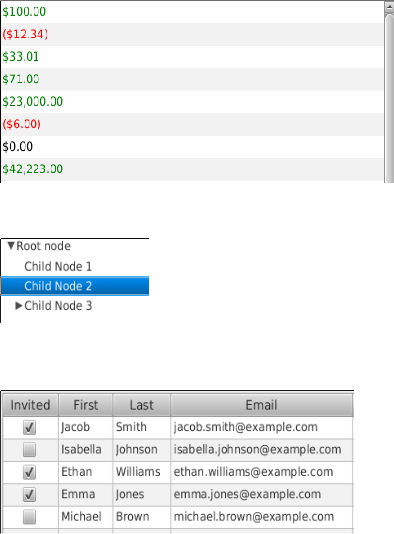
</figure>


## Les composants de JavaFX

- *Divers*
  - ComboBox 
  - ChoiceBox 
  - ProgressIndicator 
  - ProgressBar 
  - ColorPicker 
  - DatePicker 

<figure style="position: absolute; top: 20%; right: 2%">
    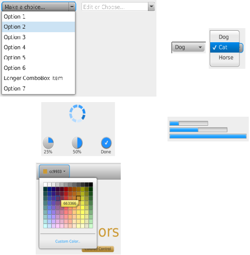
</figure>


## Les composants de JavaFX

- *Nouveautés JavaFX 8*
  - DatePicker 
  - TreeTableView
  - TreeView

<figure style="position: absolute; bottom: 5%; right: 20%">
    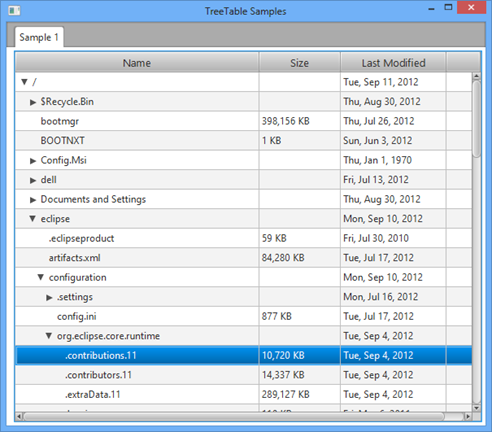
</figure>

<figure style="position: absolute; top: 10%; right: 2%; width: 40%;">
    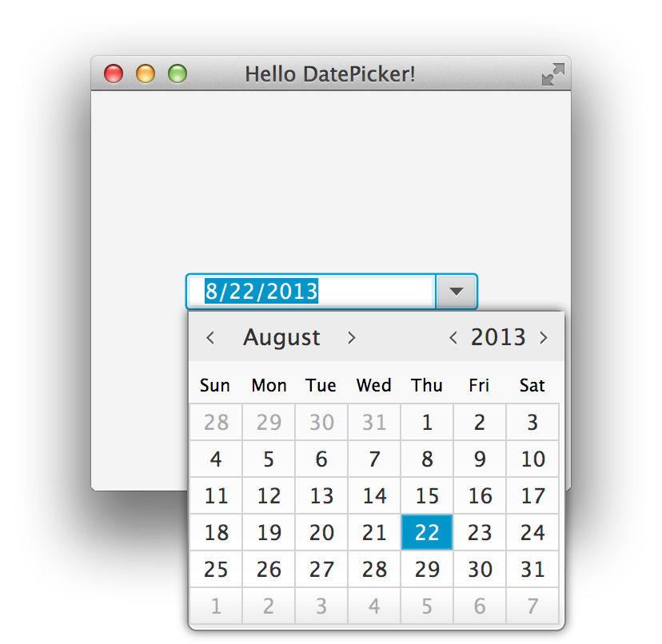
</figure>


## Les composants de JavaFX

- *Nouveautés JavaFX 8u40+*
  - Dialog
  - DialogPane
<br>
  - Alert
  - TextInputDialog
  - ChoiceDialog

<figure style="position: absolute; bottom: 58%; left: 40%">
    
</figure>
<figure style="position: absolute; bottom: 42%; right: 2%">
    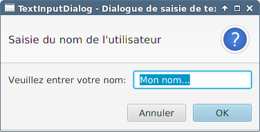
</figure>
<figure style="position: absolute; bottom: 18%; left: 40%">
    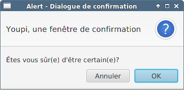
</figure>
<figure style="position: absolute; bottom: 2%; right: 2%">
    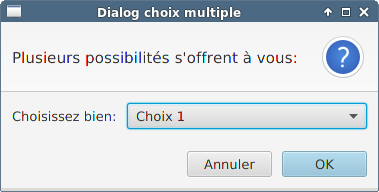
</figure>


## Le support multimédia

- *L'intégration facile des éléments multimédia*
  - *Audio* avec lecture MP3 
  - *Vidéo* (FLV, Mpeg-4 avec H.264) 
  - Ressource chargée dans un *Media* 
  - Contrôle de la lecture via *MediaPlayer* 
  - Affichage dans l'IHM via *MediaView*  
    - la barre de contrôle n'est pas incluse 

<br>

<br>

Malheureusement: pas de support de WebCam... <br>
(Intégration native nécessaire, exemple avec [OpenCV](http://opencv.org/) ) 

<figure style="position: absolute; top: 20%; right: 2%">
    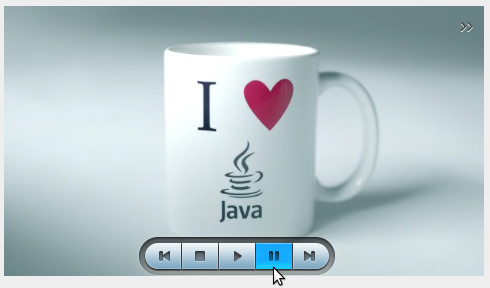
</figure>


## Le support HTML5 : le composant WebView

*Un navigateur Web complet embarqué*

- Rendu HTML5 complet 
- Support des WebSockets 
- Basé sur WebKit (et JavaScriptCore)
- Interactions possibles <br>entre Java et JavaScript

<br>


```java
WebEngine webEngine = webView.getEngine();
webEngine.load("http://www.toto.co.jp/en");

...

webEngine.executeScript("history.back()");
// équivalent à
JSObject history = (JSObject)
 webEngine.executeScript("history");
history.call("back");
```
<figure style="position: absolute; top: 12%; right: 2%; width:40%;">
    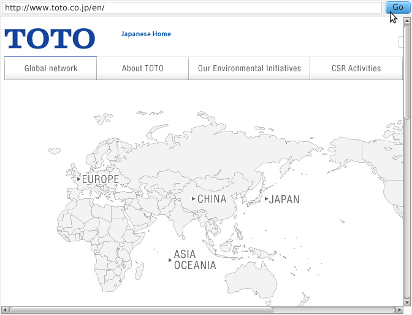
</figure>


## Les graphes : De nombreuses possibilités de représentation 

- *Les graphes les plus courants sont disponibles:*
  - Pie chart
  - Line chart
  - Area chart
  - Bubble chart
  - Scatter chart
  - Bar chart
    
- *Le modèle est basé sur des séries à afficher:* 
  - *XYChart.Series*&lt;TypeX, TypeY&gt;, *XYChart.Data*&lt;TypeX, TypeY&gt;

   ```
   series.getData().add(someDataPoint);
   chart.getData().add(series);
   ```

<figure style="position: absolute; top: 23%; right: 2%; width:40%;">
    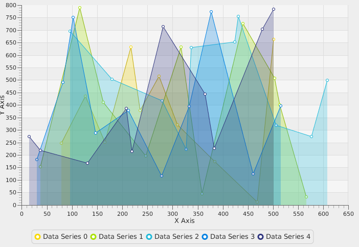
</figure>


## Organiser l'affichage : La notion de Layout

- Un layout *définit le positionnement et la dimension des composants* 
  - Il est spécifique à un conteneur 
  - Il gère la répartition de l'espace restant disponible  
  - Il réorganise l'affichage lors d'un redimensionnement 
  
- Suivant les cas un layout peut 
  - Gérer des données de positionnement absolues ou relatives 
  - Prendre en compte l'ordre d'insertion des composants 


## Layout par ancrage : AnchorPane

*L'AnchorPane, pour les cas simples*

- 4 points d'ancrage (anchor) sont définis : top, left, bottom, right 
  - Chaque composant est attaché à 1 ou plusieurs "ancrages" et s'affiche dans la partie choisie 
  - La taille préférée d'un composant est honorée
  - Un composant peut être ancré à plusieurs ancres et va alors se redimensionner pour prendre toute la largeur ou toute la longueur (left + right, top + bottom) 

<br>
  
<br>
  
Ce layout est simple mais assez limité 

<figure style="position: absolute; bottom: 8%; right: 2%; width:40%;">
    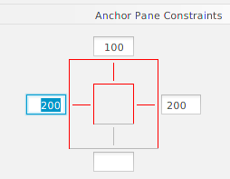
</figure>


## Layout par région d'écran : BorderPane

*BorderPane, le redimensionnement intelligent*

- 5 régions sont définies 
  - *Top*, prend toute la largeur en haut 
  - *Bottom*, prend toute la largeur en bas 
  - *Center*, zone centrale 
  - *Left*, même hauteur que center, à gauche 
  - *Right*, même hauteur que center, à droite 
- Chaque composant est affecté à une région 
  - Chaque composant est redimensionné pour occuper la région au maximum 
  - Le BorderPane essaye d'honorer les tailles définies (minimum, préférée, maximum) de ses composants. 

<figure style="position: absolute; bottom: 40%; right: 2%; width:40%;">
    
</figure>


## Layout vertical et horizontal : VBox, HBox, FlowPane / TextFlow

*Classiques mais efficaces*

- *VBox* et *HBox* 
  - Les composants sont alignés horizontalement (HBox) ou verticalement (VBox) 
  - L'espace est divisé en colonnes égales, dimensionnées pour accueillir le plus large / haut des composants 
- *FlowPane* 
  - Représente une conteneur orienté verticalement ou horizontalement 
  - Si les composants juxtaposés ou superposés atteignent le bord du contrôle, on passe à la ligne ou à la colonne suivante. 


## Layout en grille : TilePane
- *TilePane et ses « dalles » ou « tuiles » identiques* (tiles) 
  - Peut être orienté horizontalement ou verticalement (ordre de remplissage) 
  - On indique le nombre désiré de colonnes / lignes 
  - Toutes les dalles ont la même dimension
  - Chaque dalle est dimensionnée à la taille "préférée" du composant le plus volumineux 
  - La grille s'ajuste au redimensionnement (ajout / suppression de lignes ou colonnes) 


## Layout en grille : GridPane
- *GridPane et ses cellules ajustables* 
  - L'espace est divisible en un nombre arbitraire de colonnes et de lignes de toutes tailles 
  - Possibilité de fusionner des cellules adjacentes (span) 
  - L'alignement dans la cellule est paramétrable 
  - Les marges sont également ajustables 


## Layout par superposition: StackPane

- Les composants sont *empilés les uns par dessus les autres* (calques) 
  - Tout les composants sont visibles mais certains masquent les autres 
  - L'ordre d'insertion des composants définit leurs positions sur l'axe Z. 
    - Le premier élément inséré sera en dessous de la pile, le denier inséré sera sur le dessus.
  - Utile pour combiner plusieurs composants (texte par dessus une image par exemple) 
  - Il est possible en plus de jouer sur l'opacité des éléments pour des rendus graphiques intéressants
  - Tous les composants sont redimensionnés à la taille de la StackPane. 


## Taille des éléments

*Minimum, maximum, préférée*

- Tous les éléments dessinés possèdent trois valeurs de dimension pour chaque coordonnée (width et height) 
  - *minSize* : taille minimale du composant 
  - *maxSize* : taille maximale du composant 
  - *prefSize* : taille par défaut, si le composant n'a pas de dimension explicite, cette valeur sera utilisée 

- Pour qu'un élément puisse utiliser tout l'espace disponible, il faut utiliser les paramètres VGrow et HGrow 
  - Par défaut maxSize = prefSize, il faut donc modifier maxSize à la valeur Infinity pour autoriser la croissance du composant 
  - Appel de la méthode statique du layout parent.Exemple:
    ```
    VBox.setVgrow(node, Priority.ALWAYS);
    ```


## Exemple d'utilisation

```xml
<fx:root type="javafx.scene.layout.GridPane" xmlns:fx="http://javafx.com/fxml""
                alignment="BASELINE_CENTER"
                maxHeight="Infinity" maxWidth="Infinity"
                hgap="25" vgap="25">
        <padding>
                <Insets top="25" bottom="25" left="25" right="25"/>
        </padding>
        <Button text="Bouton de test"
                        maxWidth="Infinity" maxHeight="Infinity"
                        GridPane.hgrow="ALWAYS" GridPane.vgrow="ALWAYS"
                        GridPane.rowIndex="0" GridPane.columnIndex="0"/>
        <Button text="Say Hello"
                        maxWidth="Infinity" maxHeight="Infinity"
                        GridPane.hgrow="ALWAYS" GridPane.vgrow="ALWAYS"
                        GridPane.rowIndex="0" GridPane.columnIndex="2"/>
        <Label text="Un texte de test tres tres tres tres tres tres tres tres tres 
                     tres tres tres long"
                        maxWidth="Infinity" maxHeight="Infinity"
                        GridPane.hgrow="ALWAYS" GridPane.vgrow="ALWAYS"
                        GridPane.rowIndex="1" GridPane.columnIndex="0"/>
</fx:root>
```


## Définition des popups et fenêtres : profitons du multi-écrans

- *Les fenêtres pop-ups*
  - Les pop-ups sont des fenêtres simples, utilisées surtout pour des menus contextuels, des tooltips etc... 
    Elles sont par défaut sans décoration, transparentes et sans remplissage. 
  - Utilisation de la classe *javafx.stage.Popup* 
    - **show()** permet d'ouvrir la popup 
    - **hide()** permet de fermer la popup 

<br>
        
- *Les fenêtres complètes*
    - Utilisation de la classe *javafx.stage.Stage* 
      - Possibilité d'instancier un nouveau Stage possédant sa propre *Scene* 
      - Utile pour les applications multi-fenêtres et multi-écrans 


## Exemple de popup

```java

public class PopupExample extends Application {

    @Override
    public void start(final Stage primaryStage) {

        final Popup popupExample = new Popup();
        popupExample.setX(300);
        popupExample.setY(200);
        popupExample.getContent().addAll(new Circle(25, 25, 50, Color.AQUAMARINE));
        
        Button show = new Button("Show");        
        show.setOnAction(actionEvent -> popupExample.show(primaryStage));
        Button hide = new Button("Hide");
        hide.setOnAction(actionEvent -> popupExample.hide());
        
        HBox layout = new HBox(10);
        layout.getChildren().addAll(show, hide);
        primaryStage.setTitle("PopupExample Example");
        primaryStage.setScene(new Scene(layout));
        primaryStage.show();
    }
}

```


<!-- .slide: class="page-tp2" -->
