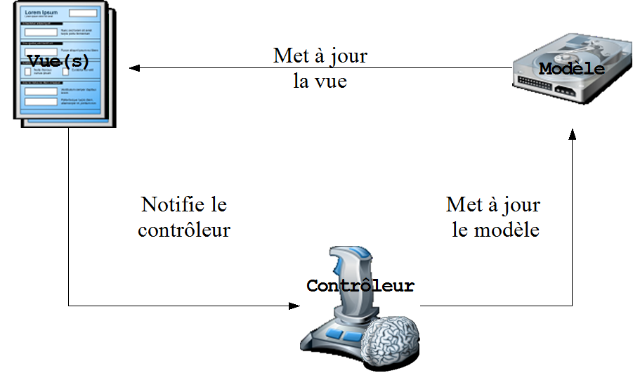
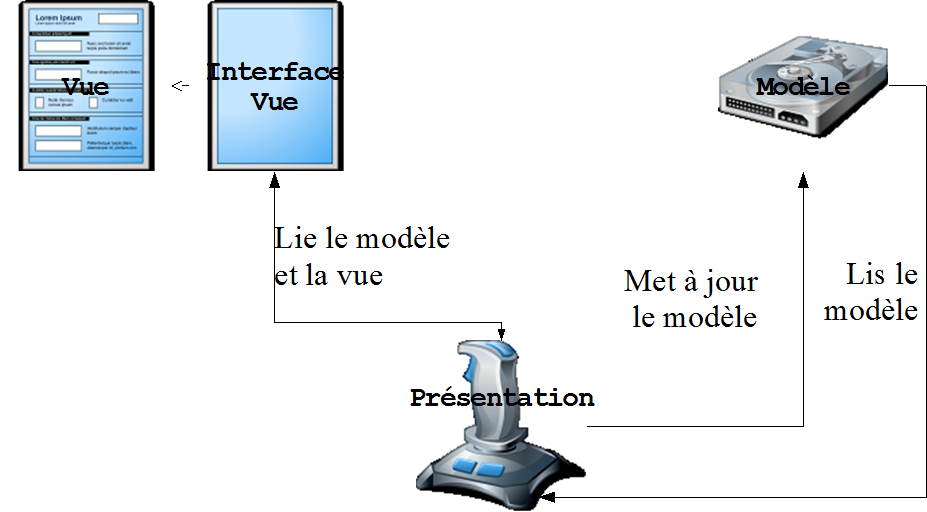
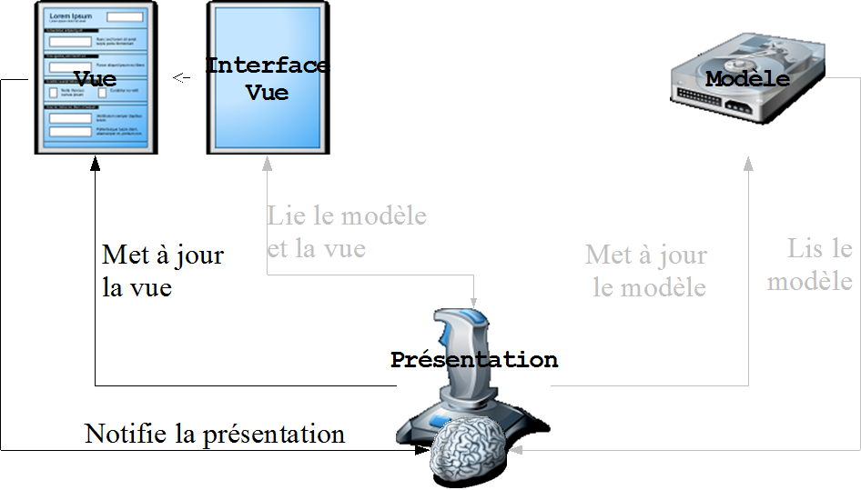
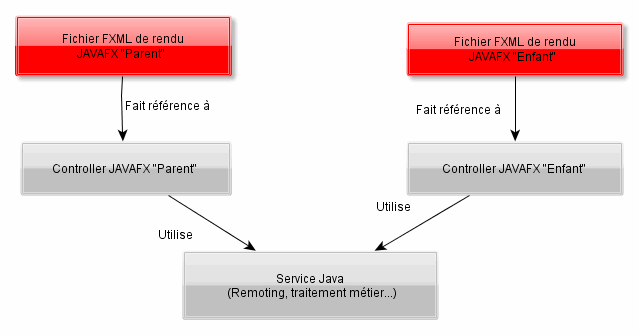

# Architecture cliente 

<!-- .slide: class="page-title" -->


## Sommaire

@@@ TODO


## Design Pattern MVC
*Découpage Model View Controller*

<figure style="width: 100%">
    
</figure>


## Design Pattern MVP
*Découpage Model View Presenter*

<figure style="width: 100%">
    
</figure>


## Design Pattern MVP
*Découpage Model View Presenter*

<figure style="width: 100%">
    
</figure>


## MVP vs MVC : Les différences principales

- *MVC : L'utilisateur intéragit avec le contrôleur*
  - Le contrôleur décrit un comportement, peut être partagé par plusieurs vues 
  - Le contrôleur choisit la vue à afficher 
  - Le modèle utilisé peut être fortement couplé à la vue, notamment par databinding 

- *MVP : L'utilisateur intéragit avec la vue*
  - Souvent une Présentation par Vue (des vues complexes peuvent avoir plusieurs Présentations), une implémentation classique en « Presentation Model » impose 1 View = 1 Presenter 
  - Le Presenter se charge du binding au modèle, la Vue en est plus fortement découplée (elle n'a pas de connaissance du modèle) 
  - Le Presenter est fortement couplé à l'interface de la Vue : plus facilement testable 


## FXML + Controller : Fonctionnement classique

- *La notion de Controller FXML possède quelques limitations* 
  - Déclaration explicite dans le fichier FXML 
  - L'utilisation d'interface est non gérée (le FXML impose que le Controller soit instanciable via un constructeur par défaut) 

- *Couplage fort entre le FXML (la Vue) et son Controller* 
  - Le FXML connait la classe de son Controller 
  - Le Controller expose des champs au FXML via annotations @FXML, voir contient des références à des composants 

- *Couplage fort possible entre le FXML et son modèle* 
  - Si on utilise des POJO avec des champs de type Property 
  - Binding utile mais couplage du modèle à JavaFX 


## FXML + Controller : Autre alternative de déclaration

- *Utilisation personnalisée de l'API FXMLLoader* 
  - Possibilité de définir un Controller Factory 
  - Possibilité de définir un Builder Factory (pour les composants) 

- *Création de FXML sans notion de Controller*
  - Celui-ci sera défini au moment du chargement  avec FXMLLoader (code Java) 
  - Plusieurs contrôleurs possibles pour un même FXML 
  - Possibilité de changer l'ordre d'instanciation des composants et contrôleurs 
  - Possibilité d'utiliser un framework d'IOC 


## Le design pattern MVVM : Model - View -  ViewModel
    
- *On peut utiliser un design pattern nommé MVVM (Model - View - ViewModel) qui est une variante de Presentation Model* 
  - Le contrôleur est une classe qui étend un composant JavaFX 
  - Chaque FXML ne connaît pas son contrôleur et ne le référence donc pas 
  - Chaque FXML a pour racine un composant JavaFX qui est le même que celui qui est étendu par le contrôleur 
  - Le contrôleur charge le FXML dans son constructeur 

- *Le composant est chargé de déclarer son propre rendu FXML* 
  - Suppression de la balise *&lt;fxml:include&gt;* 
  - Permet l'extension / surcharge des méthodes JavaFX 
  - Permet l'ajout d'événements personnalisés par databinding 


## Le design pattern MVVM : Spécificités

- Dans les exemples précédents, on travaillait "de l'extérieur":
  - FXMLLoader instanciait une élément nouveau
  - L'instanciation du contrôleur créait un objet séparé.
  
- *Ce mode doit être adapté pour MVVM*:
  - L'élément racine du FXML devient *&lt;fx:root type="ma.classe.de.Base" ... &gt;*
  - Le FXMLLoader doit préciser **setRoot(this)** et **setController(this)**  lors de la construction


## Le design pattern MVVM : exemple de FXML

```xml
<fx:root type="javafx.scene.layout.GridPane" 
         xmlns="http://javafx.com/javafx/8.0.92" 
         xmlns:fx="http://javafx.com/fxml/1">
         
   <children>
      <Label text="Login" />
      <TextField fx:id="loginUser" 
              GridPane.columnIndex="1" />
      <Label text="Password" GridPane.rowIndex="1" />
      <PasswordField fx:id="loginPassword" 
              GridPane.columnIndex="1" GridPane.rowIndex="1" />
      <Button fx:id="loginButton" onAction="#onLogin" 
              mnemonicParsing="false" text="Log in" GridPane.halignment="RIGHT" 
              GridPane.columnSpan="2" GridPane.rowIndex="2" />
   </children>
   
   <padding>
      <Insets bottom="5.0" left="5.0" right="5.0" top="5.0" />
   </padding>
</fx:root>
```


## Le design pattern MVVM : exemple de ViewModel

```java
public class LoginPane extends GridPane {

    @FXML private TextField loginUser;
    @FXML private PasswordField loginPassword;
    @FXML private Button loginButton;

    @FXML
    void onLogin(ActionEvent event) {
        System.out.println("LOGIN: "+loginUser.getText());
    }

    public LoginPane() throws IOException {
        FXMLLoader loader = new FXMLLoader();
        loader.setRoot(this);
        loader.setController(this);
        loader.setLocation(getClass().getResource("sample.fxml"));
        loader.load();
        
        loginButton.disableProperty().bind(
            Bindings.min(loginUser.textProperty().length(),
                         loginPassword.textProperty().length())
                    .isEqualTo(0));
    }
}
```


## Inversion Of Control : Injecter des dépendances

- Principe d'Hollywood « Don't call us, we'll call you » 

- *Principe de l'injection* 
  - Déclarer des objets managés par un framework IOC comme Spring 
  - Déclarer les dépendances des objets entre eux « de l'extérieur », chaque objet ne connaît pas explicitement l'autre 

  ```xml
  <beans>
    <bean id="personne" class="com.zenika.domain.PersonneImpl">
      <property name="adresse" ref="adresse" />
      <property name="profession" ref="profession"/>
    </bean>
    
    <bean id="adresse" class="com.zenika.domain.AdresseImpl">
    </bean>
    
    <bean id="profession" class="com.zenika.domain.ProfessionImpl">
    </bean>
  </beans>
  ```


## Injection et JavaFX : Fonctionnement et intégration

- *JavaFX utilise déjà le principe d'IOC (Inversion Of Control) dans ses contrôleurs* 
  - Convention : des noms identiques entre FXML et Controller 
  - Utilisation d'annotations *@FXML* 
  
- *Néanmoins, ce système est limité*, il peut être nécessaire d'étendre ce principe d'injection à d'autres classes 
  - Mutualisation de code 
  - Partage de valeurs entre plusieurs contrôleurs 
  - Intégration plus aisée à d'autres technologies Java 
  - Testabilité


## Exemple d'utilisation : FXML + Controller via IoC

<figure style="width: 100%">
    
</figure>


- Permet de gérer l'accès à des ressources communes 
- Permet de modifier par la suite l'implémentation d'un service sans impacter  les classes qui l'utilisent 


## Intégration à Spring : ControllerFactory spécifique

- Utilisation d'un Controller Factory qui utilise Spring comme instanciateur de contrôleurs 
- Possibilité d'injecter des beans Spring dans les contrôleurs 

  ```java
  public class SpringControllerFactory<T> 
     implements Callback<Class<T>, Object> {
  
     private ApplicationContext applicationContext;
       public SpringControllerFactory(final ApplicationContext appContext) {
        this.applicationContext = appContext;
     }
  
     /**
      * Instantiate JavaFX controller from Spring context.
      */
     @Override
     public Object call(final Class<T> aClass) {
        return this.applicationContext.getBean(aClass);
     }
  }
  ```


## Intégration à Spring : BuilderFactory spécifique

  ```java
  public class SpringBuilderFactory implements BuilderFactory {
      private final ApplicationContext applicationContext;
      public SpringBuilderFactory(final ApplicationContext applicationContext) {
          this.applicationContext = applicationContext;
      }

      private class SpringComponentBuilder<T> implements Builder<T> {
          private final Class klass;
          public SpringComponentBuilder(final Class klass) {
              this.klass = klass;
          }
          @Override
          public T build() {
              final T bean = (T) applicationContext.getBean(this.klass);
              return bean;
          }
      }
  
      @Override
      public Builder<?> getBuilder(final Class<?> klass) {
          final Component annotation = klass.getAnnotation(Component.class);
          if (annotation != null) return new SpringComponentBuilder(klass);
          else return new JavaFXBuilderFactory();
      }
  }
  ```


## Intégration à Spring : Passer les objets Factory au FXMLLoader 

- En redéfinissant les factories, il est donc possible d'injecter des beans Spring dans les composants et contrôleurs

```java
FXMLLoader loader = new FXMLLoader();

SpringControllerFactory springControllerFactory = 
   new SpringControllerFactory(applicationContext);
loader.setControllerFactory(springControllerFactory);

SpringBuilderFactory springBuilderFactory = 
    new SpringBuilderFactory(applicationContext);
loader.setBuilderFactory(springBuilderFactory);
```

 
- Ainsi implémenté, pour que les composants JavaFX soient instanciés par Spring ils doivent être déclarés dans le contexte Spring avec l'annotation @Component 
- Ces composants devront être déclarés en scope « prototype » car ce ne sont pas forcément des singletons 


## JavaFX + Spring :  Une association utile

*Plusieurs avantages à utiliser Spring* 

- Technologie éprouvée, support très étendu 
- Mutualisation de code facilitée sur le code métier non IHM 
- Intégration facilitée avec une grande partie des technologies Java 
- Possibilité d'utiliser Spring Events comme bus d'événement (publish / subscribe) 
- Meilleure testabilité avec la possibilité d'utiliser des classes de type mock 
- Il existe toutefois *quelques limitations au niveau de Spring AOP* car les implémentations des composants JavaFX ne tolèrent pas toujours l'injection de proxys 

<br>

*Les principes de redéfinition des factories s'appliqueraient aussi à d'autres frameworks d'injection (Google Guice, ...)*

<figure style="position: absolute; top: 15%; right: 2%; width:20%;">
    
</figure>


## Le Null Object Pattern : Principe

- *Utiliser une valeur pour symboliser la notion de "null"* 
- Exemple : une méthode retournant une List, qui retourne Collections.emptyList()  
  - Pas besoin de vérifier les valeurs nulles par des if / else 
  - On manipule toujours le résultat de la méthode de la même manière (dans notre exemple on va itérer dessus) 
  - La manipulation du null object n'aura pas d'incidence sur notre système (l'itération va se terminer immédiatement) 
<br>

<br>

*Ce pattern a eu son heure de gloire mais tend aujourd'hui à être remplacé par **Optional&lt;...&gt;**, proposé par Java8*


## Null Object Pattern : Databinding

- Lors de l'initialisation d'un écran, les données à afficher ne sont pas encore disponibles, que faire ? 
  - Utilisation d'un Glass Pane et d'un Splash Screen 
  - Indiquer dans les champs de saisie un texte spécifique 
  
- Si un écran est entièrement bindé à des objets Property, alors le null object pattern peut servir 
  - Etendre la classe métier bindable 
  - Définir dans cette classe les champs à afficher correspondants à la valeur nulle 
  - Initialiser la vue avec un objet de type Null Object 


## Null Object Pattern : Exemple

```java
public class Adresse {
    private StringProperty codePostal;
    private StringProperty codePays;
    private StringProperty cedex;
    private StringProperty localite;

    public Adresse() {		
        codePostal = new SimpleStringProperty();
        codePays = new SimpleStringProperty();
        cedex = new SimpleStringProperty();
        localite = new SimpleStringProperty();
    }
    ...
}


public class NullAdresse extends Adresse {
    public NullAdresse() {
        codePostal = new ReadOnlyStringWrapper("XXXXX");
        codePays = new ReadOnlyStringWrapper("--");
        cedex = new ReadOnlyStringWrapper("");
        localite = new ReadOnlyStringWrapper("Ville inconnue");
    }
}
```


## Databinding sans Property : le BeanPathAdapter

- Permet la génération d'objets Property à la volée à partir d'un bean Java « standard » 
  
  ```java
  BeanPathAdapter<AdresseSansProperty> adresseBeanPathAdapter = 
      new BeanPathAdapter<AdresseSansProperty>();
  adresseBeanPathAdapter.setBean(new AdresseSansProperty());
  
  Label codePostal = new Label();
  adresseBeanPathAdapter.bindBidirectional("codePostal", 
      codePostal.textProperty());
  ```
  
  - Disponible dans le toolkit jfxtras <br> 
    http://jfxtras.org/
  - Technique pouvant se montrer intéressante, surtout combinée avec un framework type MVP 


<!-- .slide: class="page-questions" -->


<!-- .slide: class="page-tp4" -->
