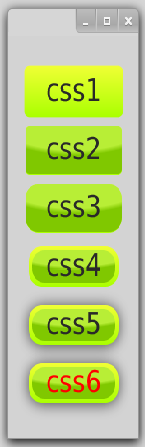
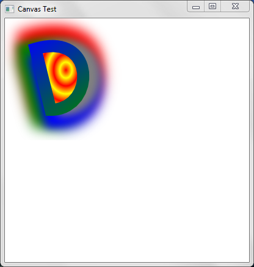
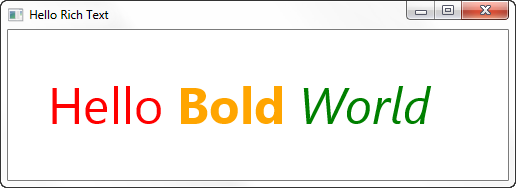
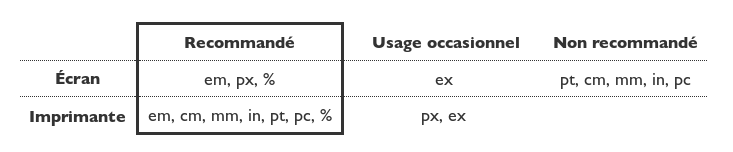
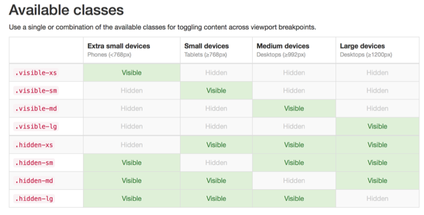

# Enrichir vos interfaces 

<!-- .slide: class="page-title" -->


## Sommaire

@@@ TODO


## Le support CSS

- *Un dérivé de CSS3 pour JavaFX*
  - Proche du modèle utilisé en HTML5 avec quelques spécificités 
    - Les propriétés dédiées à JavaFX portent le préfixe *« -fx- »* 
    - Sert à découpler rendu graphique et composition d'écran (CSS 1.0) 
    - Ne peut définir des layouts et des positionnements, la responsabilité est donnée aux composants conteneurs (contrairement à CSS 2.0) 
    - Supporte des effets graphiques intéressants (de type CSS 3.0) 
  - On retrouve des noms familiers : <br>
    **-fx-font-size, -fx-background-color, ...** 
  - D'autres plus exotiques : <br>
    **-fx-focus-traversable, -fx-use-system-menubar, ...** 


## Utilisation dans JavaFX : A plusieurs niveaux


- Feuille de style du système « theme » (définit le "look and feel") 

      java -Djavafx.userAgentStylesheetUrl=caspian
  
- Feuille de style de la Scene 

      scene.getStylesheets().addAll(Toto.class.getResource("toto.css").toExternalForm()); 

- Classe du composant (une liste de classes CSS) 

      node.getStyleClass().addAll("cssClass1", "cssClass2"); 

- Style du composant (préférer l'usage de classes CSS) 

      node.setStyle("some inline css");


## Exemple de CSS : Beaucoup de possibilités

```java
String css1 = "-fx-font-size: 30pt; "
        + "-fx-background-color: "
        + "  linear-gradient(#f0ff35, #a9ff00);";
        
String css2 = "-fx-font-size: 30pt;"
        + "-fx-background-color:"
        + "  linear-gradient(#f0ff35, #a9ff00),"
        + "  radial-gradient(center 50% -40%,"
        + "    radius 200%, #b8ee36 45%,"
        + "    #80c800 50%);";

String css3 = css2 + "-fx-background-radius: 16, 15;";

String css4 = css3 + "-fx-background-insets: 4, 8;";

String css5 = css4 + "-fx-effect: dropshadow( three-pass-box, "
        + "rgba(0,0,0,0.4) , 5, 10.0 , 0 , 1 );";

String css6= css5 + "-fx-text-fill: red;";

Button b1 = new Button("css1");
b1.setStyle(css1);

//...
```
<figure style="position: absolute; top: 15%; right: 2%;">
    
</figure>


## Personnaliser le support CSS : Ajouter des propriétés

- *Possibilité d’étendre le langage CSS JavaFX* 
  - « CSS Public API » disponible depuis JavaFX 8 
  - Factoriser les effets dans une classe et / ou propriété CSS 
  - Utilisation de StyleableObjectProperty et de CssMetadata 

- *Une bibliothèque est disponible pour faciliter l’implémentation « CSSHelper »*<br>
  N'est plus maintenue de faćon active.
  - http://www.guigarage.com/2014/03/javafx-css-utilities/

    ```xml
    <dependency>
        <groupId>com.guigarage</groupId>
        <artifactId>css-helper</artifactId>
        <version>0.7</version>
    </dependency>
    ```


## Utiliser des effets
*Un moyen simple de valoriser l’UI*

- Des effets pré-définis sont mis à disposition 
  - *Ombres* : DropShadow, InnerShadow 
  - *Flous* : GaussianBlur, BoxBlur, MotionBlur 
  - *Reflet* : Reflection 
  - *Filtres de couleur* : ColorAdjust (hue, saturation, etc...), SepiaTone 
  - *Effets lumineux* : Bloom, Lightning 
  - Bien d’autres encore! 

- Chaque effet est représenté par une classe Java étendant la classe Effect


## Utiliser l’API Effect 
*Appliquer un Effect à un Node*

```java
//Instanciation d’un Effect
DropShadow shadow = new DropShadow(5d, 5d, 2d, Color.RED);

// Instanciation d’un Node
Node text = new Text("SomeNode");

// Appliquer l’effet
text.setEffect(dropShadow);
```
<br>

```java
DropShadow shadow = new DropShadow(5d, 5d, 2d, Color.RED);
			
Reflection reflect = new Reflection();
reflect.setInput(shadow);
			
Text node = new Text("Test");
node.setEffect(reflect);
```
<figure style="position: absolute; top: 20%; right: 5%;">
    
</figure>

<figure style="position: absolute; top: 56%; right: 5%;">
    
</figure>


## Transformations
*Tirer profit du moteur graphique de JavaFX*

```java
Text nodeRaw = new Text("Test");
root.getChildren().add(nodeRaw);
			
Text node = new Text("Test");
node.setRotate(20d);     //rotation 20° vers la droite
node.setOpacity(0.45d);  //opacité 45 %
node.setScaleY(6d);      //hauteur x6
node.setScaleX(3d);      //largeur x3 
//translation, sinon les deux textes sont centrés au même endroit
node.setTranslateY(50d); //translation en hauteur de 50 unités
root.getChildren().add(node);
```

<br>

- Rotation, échelle, translation, opacité sont modifiables sur chaque Node 
- A noter : une transformation peut faire sortir un nœud de la zone qui lui a été assignée par son conteneur 

<figure style="position: absolute; top: 20%; right: 5%;">
    
</figure>


## API Shape en JavaFX 
*Dessiner divers formes*

```java
Rectangle rect = new Rectangle (200, 100);
rect.setArcHeight(50);
rect.setArcWidth(50);
rect.setFill(Color.GREY); 
rect.setStroke(Color.BLACK);
```

<br>

- Plusieurs éléments disponibles: Line, Arc, Circle, Rectangle, Polygon… 
- Chaque élément est personnalisable 
  - Modification de l’intérieur de la forme (setFill) 
  - Modification du contour de la forme (setStroke) 

<figure style="position: absolute; top: 20%; right: 5%;">
    
</figure>


## API Canvas en JavaFX
*Manipuler le GraphicsContext*

- Plusieurs usages 
  - Dessiner toutes les formes de base (cercles, rectangles…) 
  - Modifier la couleur de trait (*stroke*) et le remplissage (*fill*) 
  - Dessiner des dégradés : **gc.setFill(new RadialGradient(...))**
  - Appliquer des effets : **gc.setEffect(new GaussianBlur(...))**

<br>

- L'API Canvas ressemble à l'API HTML5 de même nom 
  - Transfert de compétences relativement aisé 
  - Très bonnes performances car optimisé GPU 


## API Canvas en JavaFX
*Exemple:*

```java

Canvas canvas = new Canvas(300, 250); 

GraphicsContext gc = 
   canvas.getGraphicsContext2D(); 


gc.beginPath();
gc.moveTo(50, 50);
gc.bezierCurveTo(150, 20, 150, 150, 75, 150);
gc.closePath();

 
gc.setFill(
   new RadialGradient(0, 0, 0.5, 0.5, 0.1, true, 
	    CycleMethod.REFLECT, 
	    new Stop(0.0, firstColor),
	    new Stop(1.0, secondColor)));
gc.fill();
```

<figure style="position: absolute; top: 20%; right: 5%;">
    
</figure>


##Canvas et interactions
*Ajouter des listeners*

```java
canvas.addEventHandler(
   MouseEvent.MOUSE_DRAGGED,
   eventHandler -> {
      // Nettoie l’endroit cliqué: effet « gomme »
      gc.clearRect(eventHandler.getX() - 2, eventHandler.getY() - 2, 5, 5);
   }
);
```
<br>

- Les Canvas sont transparents, on peut les empiler pour créer un système de couches 
- Solution la plus performante pour afficher un grand nombre de formes, particules, etc... 


## API TextFlow en JavaFX : Sublimer vos textes

```java
String family = "Helvetica";
double size = 50;

Text text1 = new Text("Hello ");
text1.setFont(Font.font(family, size));
text1.setFill(Color.RED);

Text text2 = new Text("Bold");
text2.setFill(Color.ORANGE);
text2.setFont(Font.font(family, FontWeight.BOLD, size));

Text text3 = new Text(" World");
text3.setFill(Color.GREEN);
text3.setFont(Font.font(family, FontPosture.ITALIC, size));

TextFlow textFlow = new TextFlow();
textFlow.setLayoutX(40); textFlow.setLayoutY(40);
textFlow.getChildren().addAll(text1, text2, text3);

Group group = new Group(textFlow);
Scene scene = new Scene(group, 500, 150, Color.WHITE);
stage.setTitle("Hello Rich Text");
stage.setScene(scene);
stage.show(); 
```

<figure style="position: absolute; top:13%; right: 2%;">
    
</figure>


## Responsive UI : Un écran, plusieurs supports

<br>

- *L'aspect multi-plateformes possède plusieurs challenges*
  - Support de plusieurs résolutions d'écran 
  - Support de plusieurs densités de pixels d'écran 
  - Ces notions sont regroupées sous le nom Responsive UI 

<br>

- *JavaFX ne possède malheureusement pas de support natif "Responsive"* 
  - Plusieurs techniques et outils sont disponibles pour palier ce manque 
  - Un arbitrage est à prévoir en début de projet si possible à ce sujet 


## Responsive UI : Des résolutions et ratios différents

- *La majorité des postes desktop sont aujourd'hui en full HD* 
  - 1920 x 1080 P (progressive) 
  - Format 16 / 9 

<br>

- *Les dispositifs mobiles ne possèdent pas cette résolution, ni même le même ratio* 
  - Exemple : Windows Surface Pro 3 : résolution de 2160 x 1440 en ratio 3:2

<br>

<br>

*Challenge : supporter des résolutions et des ratios différents*


## Responsive UI : Méthode naïve de mise à l'échelle

- *Après avoir conçu des écrans pour une résolution fixe* 
  - Mettre à l'échelle le rendu graphique pour une autre résolution 
  - Comme tout élément est vectorisé en JavaFX, ce principe est facile à mettre en place 
  - Les widgets et textes sont redimensionnés 
  - Possibilité de garder le ratio originel, ou remplir par des "bandes noires". 

- *Le rendu est passable si:* 
  - Le ratio est à peu près le même 
  - Peu ou pas d'images de type bitmaps à redimensionner 

- *Il suffit d'utiliser un script sur chaque racine de Scene de l'application* 
  - Rapide à implémenter 
  - Léger coût en performance


## Redimensionnement
*Exemple*

```java

public static void scaleToScreen(Window w) {
  
  double screenW = Screen.getPrimary().getVisualBounds().getWidth();
  double screenH = Screen.getPrimary().getVisualBounds().getHeight();
  Node root = w.getScene().getRoot();
  
  Bounds scene = w.getScene().getRoot().getLayoutBounds();
  double scaleX = screenW  / (scene.getWidth() +5);
  double scaleY = screenH / (scene.getHeight() +30);
  
  Scale scale = new Scale(scaleX, scaleY, 1, 0, 0, 0);
  
  root.getTransforms().setAll(scale);
  
  w.setHeight(screenH);
  w.setWidth(screenW);
  w.centerOnScreen();
  
}

```


## Responsive UI : Un problème de densité de pixels

- *Les smartphones et tablettes modernes possèdent des définitions d'écran très élevées* 
  - Exemple : iPhone 6 Plus 5.5 pouces, 1920 x 1080 P soit 441 PPI 

- *La notion de densité est désignée sous plusieurs acronymes* 
  - DPI : "dots per inch" soit en français PPP "Points Par Pouce" 
  - PPI : "pixels per inch" 

- *Cette notion est particulièrement utilisée pour définir l'affichage de textes* 
  - Paramétrable sur la plupart des OS 
  - Exemple : 96 PPP pour les textes


## Responsive UI : La question des textes

- *Une mise à l'échelle (ratio / résolution) n'est pas suffisante dans certains cas* 
  - Suivant les DPI, certains textes deviennent illisibles car trop petits! 
<figure>
    
</figure>
- *Une unité de mesure absolue a été créée: "em"* (prononcer "M")  
  - Se réfère à la taille de police par défaut du système
  - Permet de calculer des tailles relatives à la taille de police par défaut (titres en 2em par exemple) 
  - Utilisée régulièrement en HTML5 / CSS3
   
- *On ne peut pas utilier simplement 'em' dans FXML*


## Responsive UI : Que faire sans support 'em'?

- *Dans une majorité des cas on n'en a pas besoin.* 
  - On se contentera d'un custom stylesheet définissant la taille de la fonte de base, dont héritent par défaut tous les composants:

   ```css
   .root { -fx-font-size: 40px }
   ```
  - A noter: il est dommage que les CSS JavaFX ne supportent pas non plus *@media* ( [JDK-8091994](https://bugs.openjdk.java.net/browse/JDK-8091994) )

- Il est possible de *récupérer la valeur de la taille de police par défaut de l'OS ou de la valeur de la densité liée*

  ```java
  Screen.getPrimary().getDpi();
  Font.getDefault().getSize();
  ```

- *Par une cascade de bindings FXML*, on peut retravailler les IHM en mode relatif à la taille de police par défaut : un pseudo-mode EM
  - Contournement proposé par un [développeur OpenJDK](http://mail.openjdk.java.net/pipermail/openjfx-dev/2013-May/007738.html) pour FXML


## Responsive UI : Pseudo-mode EM en JavaFX
*Définir une classe représentant la mesure*
```java
public class Measurement {
  private double em;
  public  void   setEm(double em) { this.em = em; }
  public  double getEm()          { return em; }
}
```
<br>
Puis *l'intégrer par binding dans FXML*

```xml
<StackPane xmlns:fx="http://javafx.com/fxml">
  <fx:define>  
    <Measurement fx:id="u" em="26.0" /> 
  </fx:define>
  <AnchorPane id="AnchorPane" prefHeight="${22*u.em}" prefWidth="${14*u.em}" ...>
    <children>
      <Button layoutX="${4*u.em}" layoutY="${ 5*u.em}" prefWidth="${6*u.em}" ... />
      <Button layoutX="${4*u.em}" layoutY="${10*u.em}" prefWidth="${6*u.em}" ... />
      <Button layoutX="${4*u.em}" layoutY="${15*u.em}" prefWidth="${6*u.em}" ... />
    </children>
  </AnchorPane>
</StackPane>
```


## Responsive UI

*Le projet ResponsiveFX*

- Initiative pour le support de plusieurs dispositifs en JavaFX 
  - Se repose sur l'utilisation de classes CSS spécifiques pour chaque support 
  - Le toolkit reconnaît le matériel et applique le style CSS adéquat 
- Les dispositifs sont reconnus comme dans [Twitter Bootstrap](http://getbootstrap.com/)

<figure>
    
</figure>


## ResponsiveFX : Utilisation

- Il suffit d'appeler la fonction statique fournie sur le Stage 
  ```java
  ResponsiveHandler.addResponsiveToWindow(primaryStage); 
  ```

- On définit plusieurs classes CSS 
  ```css
   #toolbar { 
   -fx-background-color: deepskyblue; 
   } 
   #toolbar:extreme-small-device { 
   -fx-padding: 1 1 0 1; 
   } 
   #toolbar:small-device { 
   -fx-padding: 2 2 1 2; 
   } 
   #toolbar:medium-device { 
   -fx-padding: 6 6 1 6; 
   } 
   #toolbar:large-device { 
   -fx-padding: 6 6 1 6; 
   -fx-background-image: url(blue-background.png); 
   } 
  ```


## ResponsiveFX : Utilisation

- On applique aussi les classes souhaitées aux composants
 
```java
Toolbar extraSmallToolbar = new Toolbar(...);
extraSmallToolbar.getStyleClass().add("visible-xs");

Toolbar smallToolbar = new Toolbar(...);
smallToolbar.getStyleClass().add("visible-sm");

Toolbar mediumToolbar = new Toolbar(...);
mediumToolbar.getStyleClass().add("visible-md");

Toolbar largeToolbar = new Toolbar(...);
largeToolbar.getStyleClass().add("visible-lg");

pane.getChildren().add(extraSmallToolbar, smallToolbar, mediumToolbar, largeToolbar);
```


## Besoin  de plus?
*1 Support = 1 FXML par défaut ou 1 FXML spécifique*

- Dans certains cas, *redimensionner avec ou sans supports de ratio et densité ne suffit pas* 
  - Rendu spécifique pour certains dispositifs (logos spéciaux…) 

- Il est possible de choisir un mode spécifique basé sur FXML 
  - 1 FXML par défaut 
  - Possibilité de choisir un autre FXML si un dispositif particulier est détecté 
  - Mutualisation du code "Controller" 
  - Grande personnalisation possible 
  - Nécessite une surcouche à FXMLLoader 
  - Java First uniquement: pas de FXML First 
  - 1 seul livrable!


## Besoin  de plus?   
*Autre possibilité : décliner les UI en fonction des cibles.*
<br>

- Définir un livrable par cible 
  - Personnalisation illimitée (FXML, CSS, et même classes Java) 
  - 1 build et projet par plateforme 
  - Mutualisation de code via des dépendances statiques 
  - Plus long à développer 
  - Maintenance plus contraignante

<br>

*Il faut alors considérer chaque support comme un projet séparé: cela s'avère coûteux* 


## Impression

@@@ TODO


<!-- .slide: class="page-questions" -->

