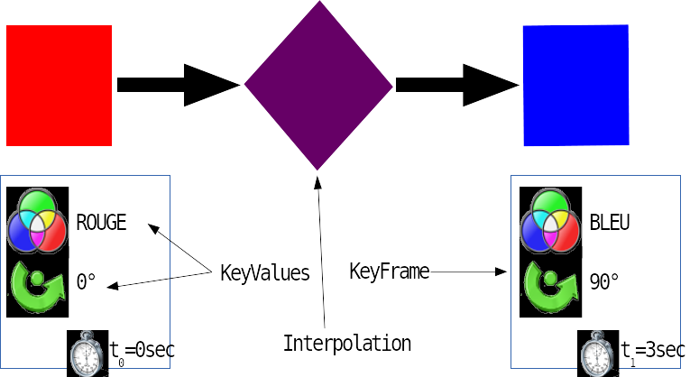
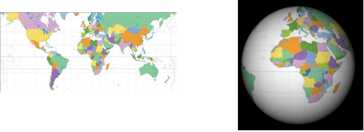

# Animations

<!-- .slide: class="page-title" -->


## Sommaire

@@@ TODO


## Le moteur de rendu Prism
*Accélération GPU: ON!*

PRISM est en charge du travail de rendu et de rastérisation des scenes JavaFX.
<figure>
    
</figure>

- *PRISM utilise ce qui est disponible:* 
  - DirectX sous Windows 
  - OpenGL sous Linux*, MacOSX, ARM
    - ... cartes NVidia/ATI avec pilotes propriétaires seulement, pour l'instant
  - Rendu logiciel (CPU) sur les plate-formes non accélérées 


## Glass Windowing Toolkit : Afficher des fenêtres

*Glass Windowing Toolkit* : la couche de gestion des opération natives du système (fenêtres, timers, surfaces, ...)
<figure>
    
</figure>

- Le style par défaut est fait pour ressembler à celui de l'OS
- Permet de styliser complètement les fenêtres de l'application
   - Exemple : barre de "titre" de l'application de démo Ensemble

<figure>
    
</figure>


## Quantum Toolkit
*Quantum Toolki* : la façade utilisée par JavaFX

<figure>
    
</figure>


- API publique JavaFX, SceneGraph (graphe des composants) 
- Permet d'utiliser des effets et animations de qualité 


## Notion d’interpolation
*Exemple classique*

<figure>
    
</figure>


## Interpoler des valeurs... Sans trop de code!

<br>

*« Une interpolation est une opération mathématique permettant de construire une courbe 
à partir des données d'un nombre fini de points, ou une fonction à partir de la donnée 
d'un nombre fini de valeurs »*

<br>

- JavaFX peut créer des données « intermédiaires » par interpolation entre plusieurs états définis comme des *KeyFrame*s 
- Mécanisme utilisé pour créer des animations fluides 
- Travail réduit pour le programmeur 


## Animations avec Timeline 

- Fonctionnement
  - Les animations de bas niveau sont basées sur une variation des propriétés d'un *Node* 
  - *Timeline* contrôle l'exécution de l'animation (lecture, cycles, etc...) 
  - *KeyValue* décrit les étapes clés : quelle propriété varie, avec quelle valeur 
  - *KeyFrame* définit à quelle durée les KeyValue sont appliquées
   
   <br>
   
*Note : les transformations jouent sur les propriétés*


## Jouer une animation : Faire apparaître un Node

<br>

```java
Text t = new Text("Zenika"); 
t.setStyle("-fx-font-size: 30pt");

KeyValue opStart = new KeyValue(t.opacityProperty(), 0d);
KeyFrame frameStart = new KeyFrame(Duration.seconds(0d), opStart);

KeyValue opEnd = new KeyValue(t.opacityProperty(), 1d);
KeyFrame frameEnd = new KeyFrame(Duration.seconds(4d), opEnd);

Timeline timeline = new Timeline();
timeline.getKeyFrames().addAll(frameStart, frameEnd);

//ajouter le nœud à la scène, afficher la scène et immédiatement démarrer l'animation
timeline.play();
```


## Combiner des interpolations

<br>

*Plusieurs opérations dans une keyframe*

Exemple : combiner une rotation et un changement d'opacité

```java
KeyValue op = new KeyValue(t.opacityProperty(), 0.5d);
KeyValue ro = new KeyValue(t.rotationProperty(), 180d);
KeyFrame frame = new KeyFrame(Duration.seconds(2.5d), op, ro);
```


## Animations avec Transition : Une alternative pratique

- Les Transitions permettent des animations de plus haut niveau 
- Elles sont prédéfinies pour les différentes transformations 
  - *FadeTransition* 
  - *FillTransition* 
  - *RotateTransition* 
  - *ScaleTransition*
  - *StrokeTransition*
  - *TranslateTransition* 


## Combiner des interpolations 

- Faciliter la combinaison d'animations : *SequentialTransition* et *ParallelTransition* 
  - Bout à bout avec SequentialTransition 
  - En parallèle avec ParallelTransition 

<br>

- Faire des déplacements complexes : *PathTransition*
  - Définition d'un Path 
  - Animation via la PathTransition 


## Transition personnalisée
*Définir sa propre interpolation*

- On peut définir ses propres Transitions pour faire soi-même l'interpolation (pour du texte par exemple) 
  ```java
  final String content = "Lorem ipsum";
  final Text text = new Text(10, 20, "");
  
  //fait apparaître lettre par lettre le texte "Lorem ipsum"
  final Animation animation = new Transition() {
  
      // Constructeur de la classe anonyme
      {
           setCycleDuration(Duration.millis(2000));
      }
  
      // Implémentation de l’interpolation	
      protected void interpolate(double frac) {
           final int length = content.length();
           final int n = Math.round(length * (float) frac);
           text.setText(content.substring(0, n));
       }
   };
  ```


## Utilisation du Z-Order
- *Le support 2.5D de JavaFX*
    - Pas de support 3D natif dans le Scene Graph 
    - Gestion de l ’axe Z toutefois possible. On peut donc contourner le problème en combinant des formes 2D : il s’agit 
      de la fausse 3D (nommée 2.5D) 
    - Par exemple, créer un cube en groupant 6 rectangles et en jouant sur les axes X, Y et Z, rotations et décalages 

<br>

<figure>
    
</figure>


## Utilisation du Z-Order
- *Activer le traitement du Z-Order*
  - Par défaut, l'ordre de profondeur (Z-Order) est défini par l'ordre d’insertion des nodes dans le Scene Graph 
  - Construire des nodes avec un translateZ n’a pas d’impact par défaut! 
  - Il faut activer le flag lors de l’instanciation de la Scene 
    ```java
    Scene scene = new Scene(root, 200, 200, true);
    ```

- *Nodes et DepthTest*
  - Propriété nommée DepthTest 
    ```java
    node.setDepthTest(DepthTest.DISABLE); // ou ENABLE, ou INHERIT (défaut)
    ```
    - Activation / désactivation / hérité du parent
  - Les test est activé par défaut sur le nœud racine


## Transformations 3D
*Prérequis*

- Tout ce qui concerne la 3D, pseudo-3D et profondeur de champ nécessite le support du GPU. 
    ```java
    // Renvoie true si la 3D est supportée
    Platform.isSupported(ConditionalFeature.SCENE3D);
    ```

- Sous Linux, un test est nécessaire 
  - Historiquement les cartes ATI ne le supportaient pas


## Scene3D
*L'arrivée de la vraie 3D*

- *Support 3D approfondi* 
  - Formes 3D prédéfinies (Cube, Cylinder, Sphere...) 
  - Formes personnalisées à partir de Mesh et TriangleMesh 
  - Gestion de la caméra (Camera, PerspectiveCamera) 
  - SubScene pour appliquer une caméra différente à une partie de la scène 
  - Gestion de l'éclairage : LightBase, AmbientLight, PointLight 
  - Application de textures : Material, PhongMaterial 
  - Shaders! 


## Exemple de rendu 3D : Sphère avec texture

<br>
```java
Material planisphere = new PhongMaterial(
	Color.TRANSPARENT,
	planisphereImageDiffuseMap,
	null, null, null);

Sphere planeteBleue = new Sphere(400);
planeteBleue.setMaterial(planisphere);
```

<figure>
    
</figure>


<!-- .slide: class="page-tp5" -->
