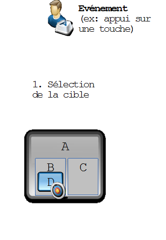
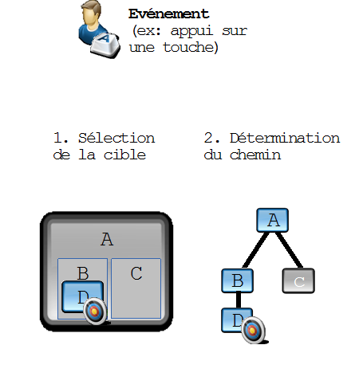
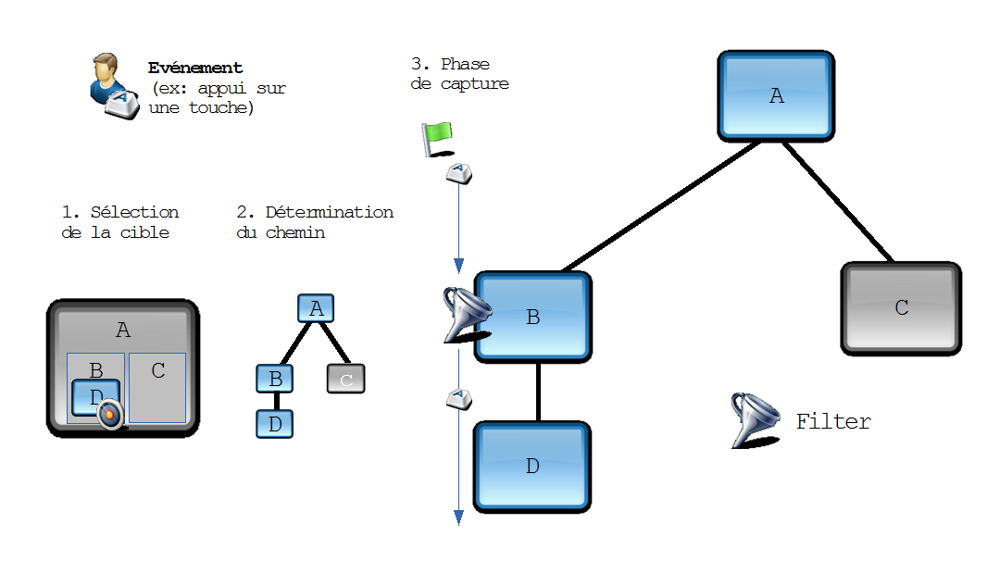
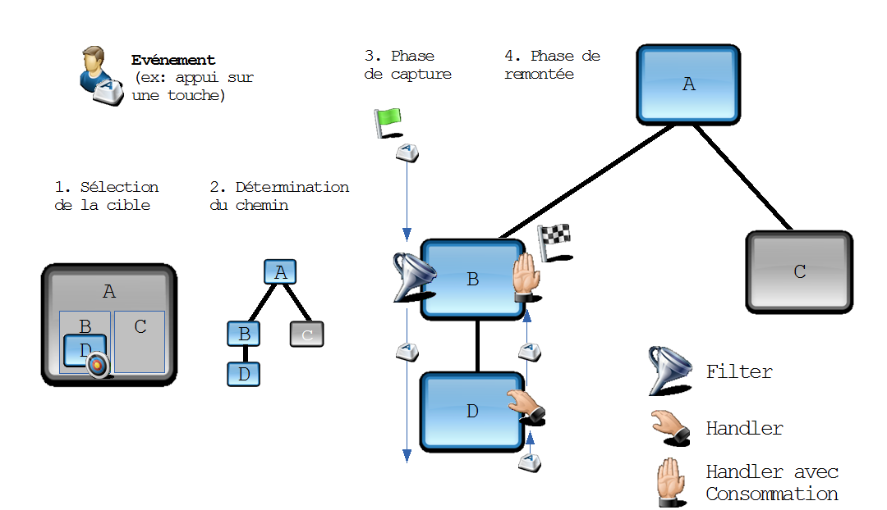

# Évenements

<!-- .slide: class="page-title" -->


## Sommaire

@@@ TODO


## Les événements locaux
*Composants et événements*

- *Un composant peut* : 
  - Posséder des méthodes publiques permettant de changer son contenu 
  - Posséder des méthodes publiques permettant de récupérer son contenu 
  - Emettre des événements personnalisés que son parent peut notamment écouter : ils sont qualifiés d'événements « locaux » 

- *Plusieurs techniques de dispatch d'événement* 
  - Par dispatch local dans la Scene : « classique » 
  - Par appel d'un EventHandler personnalisé : « databinding »


## Gestion événementielle : Classes, types, et workflow

- *Les événements sont basés sur la classe Event* 
  - Sous-classes plus spécifiques : MouseEvent, ScrollEvent, etc... 

- *Chaque événement a un type (EventType)* 
  - Les types peuvent être hierarchisés: <br> 
    InputEvent.ANY > MouseEvent.ANY > MouseEvent.MOUSE_RELEASED 

- *La diffusion d'événement se fait en 4 phases* 
  1. Sélection de la cible 
  2. Détermination du chemin 
  3. Phase de capture 
  4. Phase de remontée (event bubbling) 


## Gestion événementielle : Description des phases

- *Sélection de la cible* 
  - On détermine sur quel nœud l'interaction a eu lieu (le plus précisément et spécifiquement possible, les nœuds en avant-plan ayant la priorité). 
  - Cette cible doit implémenter EventTarget, mais c'est déjà le cas pour les Window, Scene et Node. 

- *Détermination du chemin* 
  - L'EventTarget est chargé de définir par quel chemin l'événement va être diffusé. 
  - L'implémentation par défaut sur Node renvoie un chemin allant de la Stage au nœud lui-même.  


## Gestion événementielle : Description des phases

- L'événement parcourt le chemin vers le Node cible (phase de capture), puis remonte vers son point d'origine (phase de remontée) 
  - En descendant, il est traité par d'éventuels *Filters* 
  - En remontant, il est traité par d'éventuels *Handlers* 

- Handlers et Filter peuvent choisir de consommer l'événement (**event.consume()**) 
  - Il n'ira pas plus loin dans le flux.


## Gestion événementielle : Workflow - 1

<figure>
    
</figure>


## Gestion événementielle : Workflow - 2

<figure>
    
</figure>


## Gestion événementielle : Workflow - 3

<figure>
    
</figure>


## Gestion événementielle : Workflow - 4

<figure>
    
</figure>


## Gestion événementielle

- *Utilisation sur un Node*

  ```java
  //Détermination du chemin (surcharger)
  public EventDispatchChain buildEventDispatchChain(EventDispatchChain parent)
  
  //Ajout de filtre, pour la phase de capture
  public void addEventFilter(EventType<T> type, EventHandler< ? super T>)
  
  //Ajout de gestionnaire, pour la phase de remontée
  public void addEventHandler(EventType<T> type, EventHandler< ? super T>)
  ```

- Exemple: ajout d’un listener
```java
node.addEventHandler(InputEvent.ANY, new EventHandler<InputEvent> {...});
```

- Les composants possèdent des raccourcis pour définir des listeners
```java
//sous la forme setOnEvent-type(EventHandler<? super event-class> value)
setOnMouseClicked(EventHandler<MouseEvent> handler)
```


## Choisir la bonne phase : Bubbling ou Capture event? 

- *Capture Events* (Filters)
  - Les Capture Events permettent de pouvoir stopper la propagation des événements vers les enfants 
    - Exemple : pas de support de clic sur un enfant particulier 
  - Les Capture Events étendent un comportement à l'ensemble de ses enfants 
    - Exemple : un EventFilter sur un MouseClick défini sur un GridPane, sera appelé sur chaque clic sur ce GridPane, y compris sur un de ces enfants (bouton, image...) 

- *Bubbling events* (Handlers)
  - Les Bubbling Event permettent de « remonter » des informations vers un parent après une action donnée 

<br>
*Aucune des deux phase n'est à privilégier, elles sont complémentaires!* 


## Evénements personnalisés : Emettre depuis un composant

- L'enveloppe sera de type *SauvegarderEvent* qui étend *javafx.event.Event* 
```java    
public class SauvegarderEvent extends Event {

    public static final EventType<SauvegarderEvent> DEFAULT = 
        new EventType<>("DEFAULT");

    public SauvegarderEvent() {
        super(DEFAULT);
    }
}    
```

- On émet l'événement depuis une méthode du composant
```java     
public void sauvegarder() {
	this.fireEvent(new SauvegarderEvent());
}     
```


## Evénements personnalisés : gérer l'écoute

- Ecouter un événement personnalisé depuis le parent sur l'enfant
 
```java
protected void addListenerToChild() {
  this.childComponent.addEventFilter(
    SauvegarderEvent.DEFAULT,
    sauvegarderEvent -> {
      // ...
      // faire quelque chode
      //
      // event.consume() ;
    });
```


## Alternative : Listener avec databinding

<br>

Définition d'un EventHandler greffable par Databinding dans le composant

```java
private final ObjectProperty<EventHandler<SauvegarderEvent>> onSauvegarderAction =
    new SimpleObjectProperty<EventHandler<SauvegarderEvent>>();
    
public final ObjectProperty<EventHandler<SauvegarderEvent>> onSauvegarderActionProperty() {
    return this.onSauvegarderAction;
}

public final void setOnSauvegarderAction(final EventHandler<SauvegarderEvent> handler) {
    this.onSauvegarderAction.set(handler);
}

public final EventHandler<SauvegarderEvent> getOnSauvegarderAction() {
    return this.onSauvegarderAction.get();
}
```


## Alternative : Listener avec Databinding 

*Depuis le parent:*
<br>

- En FXML 
  ```xml    
  <DetailsExamenBox fx:id="detailsExamenBox"
                    onSauvegarderAction="#sauvegarder"/>
  ```

- En Java 
```java    
protected void addListener() {
  this.childComponent.onSauvegarderActionProperty().setValue(
     sauvegarderEvent -> {
       // Code here!
     });
```    


## Alternative : Listener avec Databinding

- Emission de l'événement depuis le composant 
```java    
  public void dispatch(final SauvegarderEvent zenikaEvent) {
    final EventHandler<SauvegarderEvent> sauvegarderEventEventHandler =
      this.onSauvegarderAction.get();
    
    if (sauvegarderEventEventHandler != null) {
      sauvegarderEventEventHandler.handle(zenikaEvent);
    }
  }
```    
    - Le binding sur l'événement s'active alors si défini (valeur non nulle) et le listener est appelé 
    - Cette technique est utilisée dans l'implémentation de nombreux composants JavaFX 


## Bilan : les événements locaux

- Deux méthodes sont possibles 

- *La méthode par databinding est la plus explicite et donc recommandée* 
  - Déclaration explicite de l'événement via un ObjectProperty 
  - Possibilité de définir le handler en FXML ou Java
   
- *Le dispatch classique peut toutefois être utilisé dans certains cas* 
  - Evénements locaux « internes » au composant qui ne seront pas écoutés en dehors (exemple : clic sur cellule de tableau qui ne sera pas écouté en dehors du composant tableau) 


## Gestion du multitouch : L'arrivée des plateformes tactiles

- *Support natif dans JavaFX* 

- Ceux-ci sont gérés de manière similaire aux interactions "classiques" : 
  - *TouchEvent*
  - *GestureEvent* 
  - *ScrollEvent* : faire glisser deux doigts, axe vertical 
  - *RotateEvent* : rotation des points de contact 
  - *ZoomEvent* : "pincer pour zoomer" 
  - *SwipeEvent* : faire glisser un doigt, axe horizontal ou vertical 


## Gestion du multitouch : TouchEvent et GestureEvent

- *TouchEvent* est l'événement de bas-niveau 
  - Donne le détail des points de contact avec l'écran tactile
   
- *GestureEvent* est plus haut niveau  
  - Ses sous-classes correspondent aux 4 gestes les plus "classiques" 
  - Chaque geste (sauf le swipe) est précédé d'un événement "started" et suivi d'un "finished" 
  - Il existe une hierarchie sur les types d'événements<br>
    GestureEvent.ANY > RotateEvent.ANY <br>
    &gt; RotateEvent.ROTATE_STARTED, ROTATE,  ROTATE_FINISHED 


## Gestion du multitouch

- Exemple:
```java 
// sur un geste zoom, élargir le composant
someComponent.setOnZoom(new EventHandler<ZoomEvent>() {

    public void handle(ZoomEvent event) {
        ((Node) event.getTarget()).setScaleX(event.getTotalZoomFactor()); 
    }
});
```
- Les interactions de type zoom, défilement sont aisées 
  - Support vectoriel natif de JavaFX sur tous les éléments Node 
  - Gestion simple des événements


## Gestion du multitouch : Notes particulières

- *Les interactions tactiles peuvent donner lieu à des événements non tactiles* 
  - Exemple : drag + scroll, clic + touch, etc... 
  - **mouseEvent.isSynthetized()** à true si l'événement est tactile 
  - **gestureEvent.isDirect()** à false si l'événement provient d'un touchpad 

- Attention donc à ne pas enregistrer des listeners en double! 
  - Exemple : un listener faisant défiler la page enregistré sur le scroll et le drag aura *2x plus de mouvement que prévu* 


## Événements partagés et principe d'encapsulation

- *Parfois des événements peuvent intéresser plusieurs composants*, à priori deux méthodes sont possibles suivant l'emplacement du composant

  - Utiliser des événements locaux pour « remonter » au composant parent souhaité 
  - Utiliser des méthodes publiques sur les composants enfants pour « descendre » jusqu'au composant souhaité 

- *Principe d'encapsulation : Loi de Demeter*
    - La loi d'encapsulation (Demeter) sur les composants nous incite à ne pas descendre / remonter dans la hiérarchie de composants à plus de un niveau pour ajouter un listener propre 
    - Chaque composant du parcourt devrait donc posséder un handler / méthode publique pour router l'action au bon composant 
    - Comment rendre le développement plus rapide ?


## Bus d’événements : un design pattern utile

- La hiérarchie des composants peut : 
  - être complexe (beaucoup d'embranchements) 
  - être profonde (beaucoup de niveaux d'enfants / parents) 
  - évoluer durant le développement du projet (modifications, bugs...)

<br>

- *En définissant un bus d'événement unique à l'application (singleton), on centralise dans un bean Java l'abonnement / désabonnement à des événements globaux* 
  - Il devient donc possible d'écouter un événement « global » sans être attaché à l'arbre des composants 
  - Fonctionnement de type publish / subscribe


## Bus d’événements : cas d'utilisation 

<br>

- Le *composant B* veut s'abonner <br> à un événement du *composant F*

<br>

- Les *composants B, D et F* veulent <br> être notifiés d'une déconnexion réseau

<br>

- Les *composants C et E* veulent <br>être notifiés d'une fermeture <br>d'une popup modale

<figure style="position: absolute; top: 25%; right: 2%; ">
    
</figure>


## Bus d’événement : Implémentations
- *Plusieurs frameworks proposent des bus d'événements* clef en main
  - Spring Events 
  - RacpFX 
  - Open Dolphin 
  - Granite Data Services 
- *Choix techniques* 
  - Un bus d'événement peut s'exécuter dans l'Application Thread de JavaFX ou dans un autre géré manuellement 
  - Son utilisation peut être fortement couplée à un framework donné
  - Implémentation simple mais attention aux memory leaks (*WeakReference*) 

<br>
*Attention: le bus d'événements ne doit pas se substituer à l'aspect observable du modèle*


<!-- .slide: class="page-questions" -->


<!-- .slide: class="page-tp6" -->
