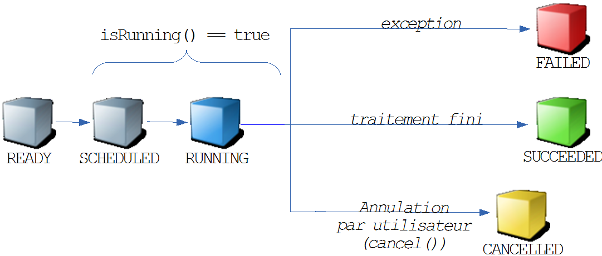

# Concurrence

<!-- .slide: class="page-title" -->


## Sommaire

<!-- .slide: class="toc" -->

- [Présentation de JavaFX 8](#/1)
- [Première application](#/2)
- [Éléments graphiques](#/3)
- [Databinding](#/4)
- [Architecture](#/5)
- [Enrichir vos interfaces](#/6)
- [Animation](#/7)
- [Événements](#/8)
- **[Concurrence]**
- [Intégration avec Swing](#/10)
- [Tests et outils](#/11)


## Introduction : Traitements simultanés en JavaFX

- *JavaFX est optimisé pour le traitement concurrent*
  - Plusieurs traitements simultanés sont possibles 
  - Appels de méthodes de type « callback » asynchrone en fin d'un traitement 
  - API fournie pour une intégration souple avec l'IHM 
  - API compatible avec les possibilités de concurrence natives de Java 

- *Concurrence et multithreading : sujet délicat* 
  - Complexe 
  - Difficile à déboguer 
  - Exigeante : seul le niveau parfait est correct 
  - Performante si bien modélisée 

- *Indispensable en JavaFX* 


## JavaFX Application Thread : GUI Thread et implications 

- *Un Application Thread (AT) dédié à la manipulation des graphes* 
  - Dessine les composants de la vue 
  - Gère les événements de l'application 
  - Exécute le code des composants JavaFX 

- *Problèmes liés* 
  - Tout traitement long effectué dans l'Application Thread « gèle » ou ralentit l'affichage de l'application ! 
  - Aucun input utilisateur n'est reconnu (le thread ne gère plus les événements) 
  - Nécessité de comprendre et maîtriser le multithreading et l'asynchronisme 


## Challenges techniques : Comment gérer la concurrence?

- *Principales problématiques en JavaFX* 
  - Comment créer et gérer de nouveaux threads ? 
  - Comment interagir entre threads personnalisés et l'Application Thread ?
   
- *Cas classiques d'utilisation:* 
  - Appels HTTP ou autres types de requêtes sur le réseau 
  - Accès filesystem (ouverture de fichiers) 
  - Accès base de données distante ou locale 
  - Longue computation (déchiffrement, compression de données volumineuses...) 


## Le Multi-threading : quelques possibilités avec JavaFX

- Utiliser un *pool de threads dédié* 

- Obtenir une *notification lors de la fin d'un traitement, ou de son échec* 
  - Exemple : chargement d'une image terminé, afficher l'image 
- Obtenir une *notification de la progression en cours du traitement*
  - Exemple : téléchargement effectué à 35 % du total attendu 
- Implémenter des *tâches périodiques* 
  - Exemple : ping périodique d'un serveur pour vérifier le réseau 


## Créer un traitement asynchrone : API Thread et Runnable

- Instancier un *Thread* qui aura pour charge d'exécuter du code hors JavaFX 
  - Par défaut, un Thread est en mode idle 
  - Démarrage via la méthode **start()** 
  
- Définir un *Runnable* possédant le code à exécuter ( ou lambda ) 
  ```java
  Thread thread = new Thread(new Runnable() {
    @Override
    public void run() {
      // To Be executed!
    }
  });
  thread.start();
  ```

- Il est possible de créer un pool de Threads pour plus de souplesse 


## Accéder à l’Application Thread depuis un autre Thread

- Utilisation de la méthode statique Platform.runLater(...)
  ```java
  
      final Label label = new Label("Un traitement hors Application Thread !");
      
      public void startThread() {
          Thread thread = new Thread(this::delayedChangeLabel);
          thread.start();    
      }
      
      private void delayedChangeLabel() {
          Thread.sleep(3000); // note: try/catch supprimé pour la lisibilité
  
          Platform.runLater(
              () -> label.setText("Done !")
          );
      }
  ```


## Notes sur Platform.runLater() : Précautions

- En cas d'*exécution de code IHM en dehors de l'Application Thread*, on obtient une exception 
  > java.lang.IllegalStateException: Not on FX application thread; 
  > currentThread = xxx

<br>

- On délègue à JavaFX le soin d'exécuter le code *quand cela lui semble optimal* 
  - Pas de garantie en ordre de temps sur l'exécution du callback 
  - Que faire si on a beaucoup de callbacks ? Faut-il toujours utiliser **Platform.runLater(...)** ?


## API Worker : Faciliter les traitements asynchrones

- *JavaFX met à disposition un framework de concurrence pour faciliter l'utilisation des threads* 
  - Meilleure maintenabilité 
  - Meilleure prédictibilité 
  - Meilleure performance
   
- *Les classes se trouvent dans le package javafx.concurrent* 
  - Interface *Worker*  
  - Implémentations disponibles à étendre : *Task* et *Service* 
  - Support de callbacks (en nombre limité) dans le JavaFX Application Thread natif! 


## API Worker : Fonctionnalités

- *La progression est écoutable via des propriétés exposées* 
  - **totalWork** : représente la charge totale de travail, unités arbitraires 
  - **workDone** : représente la charge de travail déjà effectuée 
  - **progress** : pourcentage de travail effectué, double entre 0 et 1, calculé 
  - **title** et **message** peuvent servir à communiquer un status à l'utilisateur 

- *Implémentation d'un Worker* 
  - Méthode **call()** utilisée en cas de succès 
  - Si une exception fait échouer le traitement, la propriété **exception** contiendra les informations de l'échec


## API Worker : Propriétés exposées
<br>

Etats internes du Worker

<br>

<figure>
    
</figure>


## Implémentation de Worker : Extension de l'API Task 

- *Task : Abstraction fournie basée sur Worker* 
  - Implémentation concrète de *Worker&lt;T&gt;* 
  - Implémentation de *FutureTask&lt;T&gt;*  
  - Exécutable de manière "classique" selon l'API Java Concurrency 

- *Task représente un traitement unique, il ne peut être réutilisé* 
  - Il doit être garbage collecté sous peine de leak mémoire 
  - Ne pas garder de référence définitive à un objet de ce type 


## API Task : Exemples d’utilisations 

- *Réagir aux transitions d'état* 
  - En surchargeant les méthodes **cancelled(), succeeded(), failed()**, etc... 
  - En bindant les propriétés **onCancelledProperty(), onFailedProperty(), … **
  - En ajoutant des *EventHandler<WorkerStateEvent>* via **setOnCancelled, setOnFailed, ...** 

- Méthodes pour mettre à jour le titre et le message 

- Méthodes pour mettre à jour la progression 
  - **updateProgress(workDouble, totalWork)** 


## API Task : Emettre des résultats intermédiaires

```java
public class PartialResultsTask extends Task<ObservableList<String>> {

  private ReadOnlyObjectWrapper<ObservableList<String>> partialResults =
    new ReadOnlyObjectWrapper<>(this, "partialResults",
                                FXCollections.observableArrayList(
                                  new ArrayList<String>()));

  public final ObservableList<String> getPartialResults() { 
	  return partialResults.get();
	}

  public final ReadOnlyObjectProperty<ObservableList<String>> 
    partialResultsProperty() {
    
    return partialResults.getReadOnlyProperty();
  }

  //... méthode call() au slide suivant

```


## API Task : Implémentation de call

```java
@Override 
protected ObservableList<String> call() throws Exception {

    updateMessage("Création de donnée..."); // montrer à quelle étape on est
    
    for (int i=0; i<100; i++) {
        if (isCancelled()) break; // gérer l'annulation
        final String s = "Zen"+i;

        //pousser le résultat partiel dans l'Application Thread
        Platform.runLater(()  -> {
          partialResults.get().add(s);
        });

        //Notifier de l'avancement
        updateProgress(i, 100);
    }

    //le résultat final est la collection complète
    return partialResults.get();
}
```


## API Executor :  Depuis JDK1.5

- *Le but est de découpler le code à exécuter (Runnable) et la manière de l'exécuter, la tuyauterie implémentée par l'Executor* 
  - Réutilisation des threads 
  - Scheduling 
  - Cache et pool de threads


## API Executor : Implémentations fournier

- *Des implémentations concrètes sont instanciables via Executors.newXXX()* 

```java
// le plus simple:
Executors.newSingleThreadExecutor();

// avec du cache et un nommage personnalisé des threads 
// (implémentation naïve de ThreadFactory)
ThreadFactory factory = new ThreadFactory() {

	private int count = 0;

	public Thread newThread(Runnable r) {
		return new Thread(r, "ZenThread-"+(count++));
	}
}
Executors.newCachedThreadPool(factory)
```


## API Executor : notion de Future

- *ExecutorService* étend *Executor* pour ajouter la notion de *Future* 
- *Future<T>* représente la promesse d'un résultat à venir - avec un résultat de type T - asynchrone 
- On peut attendre ce résultat en bloquant (**f.get()**), ou préciser un timeout et réessayer plus tard (**f.get(timeout, unit)**) 
- Possibilité d'annuler la tâche 
- Intégrable dans l'API Service de JavaFX


## API Service : pour mieux gérer les Task 

- Pallie la limitation des exécutions uniques des *Task* en créant une abstraction supplémentaire
- Le but d'un *Service* est de pouvoir définir des tâches spécifiques, de manière répétitive 
- On peut l'associer à un *Executor* spécifique ou le laisser créer le sien 
- Un *Service* est techniquement une Factory de *Task* 


## API Service : Exemple

- Les propriétés du service sont bindées à celles de la tâche en cours 
- **start()** pour lancer la tâche, **restart()** pour annuler une tâche en cours et en lancer une nouvelle 

```java
Executor executor = Executors.newCachedThreadPool();

Service<String> zenService = new Service<String>() {

    protected Task<String> createTask() {
        return new Task<String>() {
            protected String call() throws Exception {
                return "ZenService s'est lancé";
            }
        };
    }
};

zenService.setExecutor(executor);
zenService.start();
```


## API Service : Interactions entre Service et Task

Pour un service avec des paramètres d'entrée, exposer ces paramètres sous forme de propriétés 
et les capturer à la création de la Task


```java
private static class SplitterService extends Service<String[]> {

    private final StringProperty toSplit = new SimpleStringProperty();

    protected Task<String[]> createTask() {

        //alternativement, capturer dans le constructeur de la tâche
        final String work = toSplit.get(); 
        return new Task<String[]>() {

            protected String[] call() throws Exception {
                return work.split(" ");
            }
        };
    }
}
```


## API Service : Interactions entre Service et Task 

Récupérer le résultat de la Task via l'événement onSucceeded

```java
SplitterService service = new SplitterService();

//passer la donnée
service.setToSplit("Zenika Service");

//capturer le résultat
service.setOnSucceeded(new EventHandler<WorkerStateEvent>() {

    public void handle(WorkerStateEvent wse) {
        //méthode exemple, pourrait afficher chaque mot dans une table
        afficherUnParLigne((String[]) wse.getSource().getValue());
    }
});

service.start();
```


## Pour aller plus loin: une Factory de Services? 

- *Il est possible de définir une abstraction au-dessus de l'API Service afin de rendre automatique la définition de paramètres courants*
  - Pool de threads spécifique 
  - Handlers par défaut sur les événements d'échec 
  - Ajout de logs dans les threads utilisés 

- *Comme les traitements ont lieu hors Application Thread, les logs générés dans ces threads ne sont pas accessibles par défaut dans la console Java* 
  - Une factory de Service permet donc de rendre plus aisé le déboguage 


<!-- .slide: class="page-questions" -->


<!-- .slide: class="page-tp8" -->


<!-- .slide: class="page-tp9" -->
