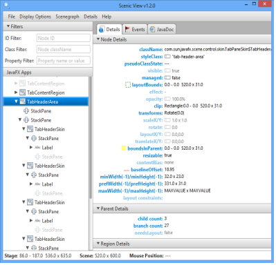
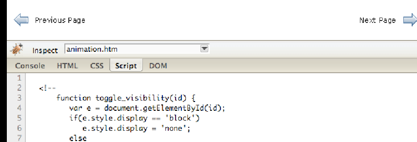
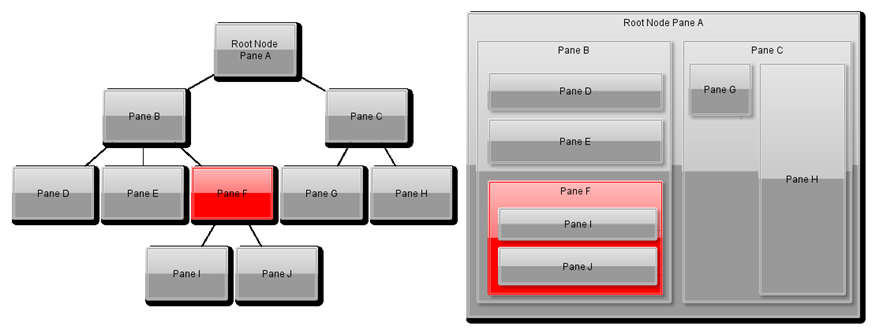
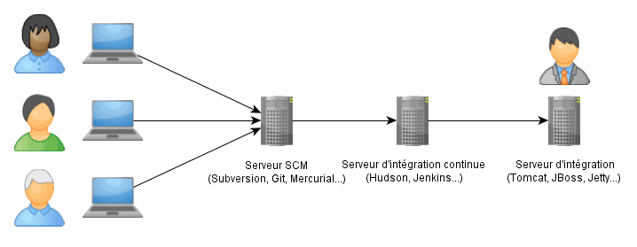

# Tests et outils

<!-- .slide: class="page-title" -->


## Sommaire

<!-- .slide: class="toc" -->

- [Présentation de JavaFX 8](#/1)
- [Première application](#/2)
- [Éléments graphiques](#/3)
- [Databinding](#/4)
- [Architecture](#/5)
- [Enrichir vos interfaces](#/6)
- [Animation](#/7)
- [Événements](#/8)
- [Concurrence](#/9)
- [Intégration avec Swing](#/10)
- **[Tests et outils]**


## Les outils de base : SceneBuilder et ScenicView

- *SceneBuilder* est l'outil officiel pour la construction de FXML de manière visuelle
  - http://gluonhq.com/open-source/scene-builder/
 
- *ScenicView* est un outil externe
  - http://fxexperience.com/scenic-view/ 
  - Inspection d'une application JavaFX en live 
  - Modifications de propriétés en live

<figure style="position: absolute; bottom: 10%; right: 1%;">
    
</figure>


## Ressources et liens utiles

- La documentation officielle d'*Oracle*
  - http://docs.oracle.com/javase/8/javase-clienttechnologies.htm

- *Gluon*, a repris les ports JavaFX vers Android ou iOs, et proposent de nombreux projets JavaFX
  - http://gluonhq.com/open-source/

- *FX experience* : propose des ressources intéressantes (notamment ScenicView et ControlsFX) ainsi que des 
   publications régulières autour de JavaFX 
  - http://fxexperience.com/

- *JFXtras* regroupe de nombreux contrôles et outils utiles au quotidien
  - http://jfxtras.org/

- *JFoenix* : JavaFX "material design"
  - http://jfoenix.com/


## Le composant WebView : Débogage HTML5/Javascript

- L'utilisation de *FireBug* intégrable dans JavaFX 
- Injection via le WebEngine
```java
engine.executeScript("code standard d'injection FireBug Lite"); 
```

<br>

<figure >
    
</figure>


## Les IDE disponibles : Eclipse

*E(fx)clipse* 
( [Eclipse Foundation](http://www.eclipse.org/) | [BestSolutions](http://efxclipse.bestsolution.at/index.html) )

- *Forces (interne)* : basé sur Eclipse, gratuit et open source, adoption très large, support de JavaFX efficace, support de FXGraph
- *Opportunités (externe)* : développement de plugins, support de nombreuses technologies et langages, intégration définitive du plugin dans Eclipse

<br>

- *Faiblesses (interne)* : performances, plugins de qualités inégales, intégration Maven et WTP instables, nécessite souvent l'ajout de plugins
- *Menaces (externe)* : support communautaire pas toujours adapté aux entreprises, performances pouvant se dégrader, instabilité dans certaines versions


## Les IDE disponibles : IntelliJ

*IntelliJ *
( [JetBrains](https://www.jetbrains.com/) )


- *Forces (interne)* : Performances, robustesse, intégration Maven, support JavaFX efficace, haut niveau de personnalisation
- *Opportunités (externe)* : Support de nombreuses technologies et langages, support de Java 8 et lambdas, inspections de code très étendues

<br>

- *Faiblesses (interne)* : Payant (500$ pour une licence professionnelle), moins répandu en entreprise qu'Eclipse à ce jour
- *Menaces (externe)* : Evolution du support JavaFX dépendant du succès de la technologie


## Les IDE disponibles : NetBeans

*NetBeans* ( [Oracle](https://netbeans.org/) )

- *Forces (interne)* : Supporté par Oracle (solution officielle), intégration de JavaFX bien documentée
- *Opportunités (externe)* : Support de JavaFX assuré par Oracle dans les prochaines versions

<br>

- *Faiblesses (interne)* : Adoption marginale, intégration à des technologies non Oracle limitée, écosystème peu étendu
- *Menaces (externe)* : Adoption de NetBeans demeurant marginale


## Tests et IHM : Plusieurs options

- *Plusieurs solutions existent* 
  - Configuration manuelle de tests spécifique pour JavaFX 
  - Utiliser les toolkits disponibles (JemmyFX, MarvinFX, TestFX, ...)

- *Tester l'IHM est un processus lourd*
  - Très coûteux
  - Difficilement maintenable 
  - Instable de temps à autres 
  - Complexe et long à mettre en place 
  - Plus fiables que des tests manuels car automatiques 
  - A terme moins coûteux et couvrant un plus grand scope que des tests manuels 


## JemmyFX : l'outil officiel

Originellement d'Oracle et transféré à OpenJFX en 2012

- *Disponible uniquement sous forme de sources* (repository mercurial de JavaFX) 
  - Build manuel du projet 
  - Déploiement de l'artifact manuel dans Maven 
  - L'intégration dans une usine logicielle n'est donc pas native 

- *Solution utilisée par Oracle pour les tests IHM* 
  - API bas-niveau, utilisée pour tester chaque composant de JavaFX 
  - Ajoute des abstractions nommées « Dock » et « Wrap » pour effectuer des tests 
  - Utilise par défaut un mode d'émulation par événement JavaFX mais peut utiliser un mode par robot (événement de type système)
   
- *Ne semble plus beaucoup évoluer*


## MarvinFX : l'alternative open source

- Solution open source de test pour JavaFX <br>
  https://github.com/guigarage/MarvinFX 

- *Fonctionnalités*
  - Micro framework de test pour JavaFX 
  - Simple d'utilisation 
  - Peu de features 
  - Efficace
 
- *Problématique*
  - Projet qui n'évolue plus depuis 2013?


## TestFX : la solution de SmartBear  

- Originellement intégré dans *LoadUI* (produit payant) 
  - Intégré dans la solution payante *TestComplete* 
  - Peut être utilisé seul en open source<br> 
    https://github.com/SmartBear/TestFX 

- SmartBear est un éditeur connu surtout pour son produit *SoapUI* 

<figure style="position: absolute; bottom: 5%; left: 5%; width: 25%">
    
</figure>
<figure style="position: absolute; bottom: 10%; left: 40%; width:20%">
    
</figure>
<figure style="position: absolute; bottom: 8%; right: 7%; width: 15%">
    
</figure>


## TestFX : Exemple

```java
@Category( TestFX.class )
public class LabelForTest extends GuiTest {
        @Override
        protected Parent getRootNode() {
                TextField uText = TextFieldBuilder.create().id( "uname" ).build();
                TextField pText = PasswordFieldBuilder.create().id( "pword" ).build();
                Label u = LabelBuilder.create().text( "User name" )
                          .labelFor(uText).build();
                Label p = LabelBuilder.create().text( "Password" )
                          .labelFor( pText ).build();
                GridPane grid = new GridPane();
                grid.add( u, 0, 0 );
                grid.add( uText, 1, 0 );
                grid.add( p, 0, 1 );
                grid.add( pText, 1, 1 );
                return grid;
        }
        @Test
        public void shouldClickButton() {
                click( nodeLabeledBy("User name") ).type( "Steve" );
                click( nodeLabeledBy("Password") ).type( "duke4ever" );
                verifyThat( "#pword", hasText( "duke4ever" ) );
        }
}
```


## Testabilité d'une IHM : Comment faire?

<br>

*Contexte de test <br> &ne; <br> Contexte applicatif*

<figure style="position: absolute; top: 12%; right: 2%; width:40%">
    
    <figcaption>Contexte de test</figcaption>
</figure>
<figure style="position: absolute; bottom: 8%; right: 2%; width: 50%">
    
    <figcaption>Contexte de l'application complète</figcaption>
</figure>


## Composants testables : Bonnes pratiques 

- *Respect du principe d'encapsulation (loi de Déméter)* 
  - Un composant ne peut modifier que ses enfants directs 
  - Pas de modification de son parent direct 
  - Pas de modifications de ses petits-enfants directement 

- *Pour signaler des actions à faire sur son composant parent, il est  possible d'envoyer un événement personnalisé* 
  - Le parent écoute l'événement et effectura les modifications voulues  lors de celui-ci 
  - Utilisation d'un bus d'événement en cas de hierarchie complexe de  composants / ou d'événement à écouteurs multiples 

- *Navigation en cascade* : Un composant gère la navigation par actions sur ses enfants directs,  qui répercutent cette navigation sur les leurs, etc 


## Usine logicielle : Une intégration souple 

- *JavaFX dispose d'un plugin Maven* 

- *Principe de l'intégration continue:* 
  - Le livrable est construit sur le serveur d'intégration continue 
  - Déploiement automatique possible sur un serveur d'intégration des  versions 
  - Signalement automatique des erreurs de builds 

<figure>
    
</figure>


## Maven et JavaFX : Description du plugin

https://github.com/javafx-maven-plugin/javafx-maven-plugin

- Support des différents types de déploiement JavaFX
  ```xml
  <dependency>
      <groupId>com.zenjava</groupId>
      <artifactId>javafx-maven-plugin</artifactId>
      <version>8.4.0</version>
  </dependency>
  ```
  - Avec ou sans JVM 
  - Web ou client lourd
  - Possibilité de signer les livrables 

- Un archetype est disponible pour créer un patron d'application JavaFX 
  [com.zenjava:javafx-basic-archetype, version 8.1.5](http://mvnrepository.com/artifact/com.zenjava/javafx-basic-archetype/8.1.5)


## JavaFX : sur plateforme ARM et sur téléphone?

- *Pas de support officiel par Oracle* 
  - En ce qui concerne ARM:<br>
    « Starting with JDK 8u33, JavaFX Embedded is removed from the ARM bundle and is not supported »

- *La communauté prend le relai (OpenJFX / Gluon)* 
  - JavaFX Android Ports
  - RoboVM iOS
  - Binaires ARM


## JavaFX sur Android ou iOs

- *L'intégralité des projets de portages sont désormais pilotés par Gluon* <br>
  http://gluonhq.com/open-source/javafxports/

- Pour faciliter l'intégration, Gluon propose des plug-ins pour NetBeans, IntelliJ ou Eclipse

<figure>
    
</figure>


## Langages alternatifs autour de JavaFX : De nombreux choix

- *GroovyFX* 
  - Utilisé à la place de FXML en mode compilé 
  - Intégration possible avec Griffon (Grails pour frontend JavaFX)
   
- *ScalaFX* 
  - Utilisé à la place de FXML en mode compilé
   
- *FXGraph + XTend* 
  - Intégration dans E(fx)clipse native 
  - FXGraph remplace FXML en mode interprété 
  - Compilation possible de FXML / FXGraph (plugin instable en alpha) 


<!-- .slide: class="page-questions" -->

