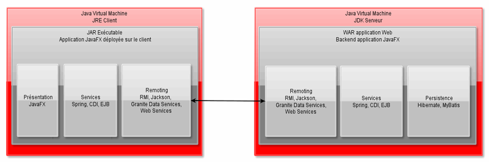

# Annexes

<!-- .slide: class="page-title" -->


## Lambdas, call-backs : une évolution importante

Exemple de contrôleur trivial, façon Java6 (classe anonyme)

```java
public class Controller implements Initializable {
    @FXML
    private Button button;
    @Override
    public void initialize(URL location, ResourceBundle resources) {
        button.setOnAction(new EventHandler<ActionEvent>() {
            @Override
            public void handle(ActionEvent event) {
                // exemple d'action
                System.out.println("C'est OK!");
            }
        });
    }
}

```

- Quelques inconvénients:
  - Très verbeux
  - Des actions enchaînées rendent le code atroce ("Callback Hell")


## Lambdas, call-backs : Java8

*Java8 : utilisation des lambdas*
  ```java
  button.setOnAction(e -> {
    // exemple d'action
    System.out.println("C'est OK!");
  });
  ```
  - Code plus dense
  - Paramètres difficiles à comprendre (qu'est-ce que 'e' ?)<br>
    - *Les paramètres reprennent le nom de leur type (**actionEvent** plutôt que **e**)*
  - Code difficile à lire (code appelant et callback mélangés)
    - *Une lambda doit rester courte : pas plus de 2 ou 3 lignes* 
  - Callback Hell
    - *Ne jamais imbriquer des lambdas.*


## Lambdas, call-backs : Java8

*Java8 : utilisation des références de fonction*
  ```java
     public void initialize(URL location, ResourceBundle resources) {
       button.setOnAction(this::buttonClicked);
     }

     private void buttonClicked(ActionEvent actionEvent) {
       // exemple d'action
       System.out.println("C'est OK!");
     }  
  ```

  - Code dense
  - Facile à lire, facile à débugger
  - *Important: donner un nom explicite aux fonctions* 


## Notes


## Architecture N-tiers : schéma

Il peut être intéressant d'avoir un framework pour faciliter les synchronisations avec un serveur distant des données dans un mode distribué (comme Granite)


<figure>
    
</figure>


## Granite Data Services : Framework complet orienté JEE
- Framework d'intégration serveur pour JavaFX, Android et Flex 
- Permet de faciliter les échanges avec un serveur Java 
  - Spring + Hibernate côté serveur ou EJB3 
  - Sérialisation des entités vers le client JavaFX 
  - Messaging via WebSockets compatible JMS 
  - Génération de classes avec Property (compatibles databinding) 

- Version simple gratuite open source 
- Version payante complète open source 


## Granite Data Services : Résumé

- Avantages de la solution 
  - Payload très compact (marshalling JMF ou AMF) 
  - Possibilités d'architecture real-time 
  - Multi-supports 
  - Intégration poussée des solutions JEE / Spring / Hibernate 
  - Intégration facile à une usine logicielle 
  - Framework MVP côté JavaFX 

- L'utilisation de Granite est très profitable si 
  - Mode connecté >> Mode déconnecté 
  - Stack technique Java importante 
  - Le paiement de la licence Granite est possible 
